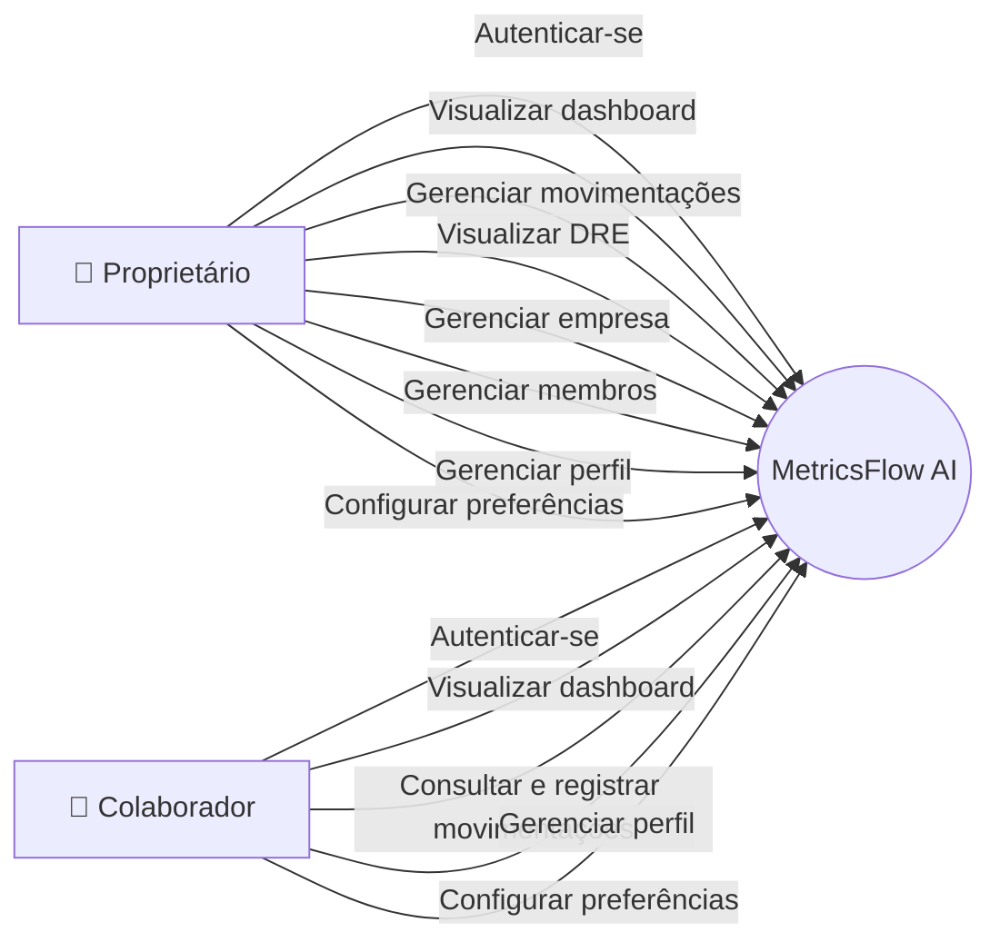
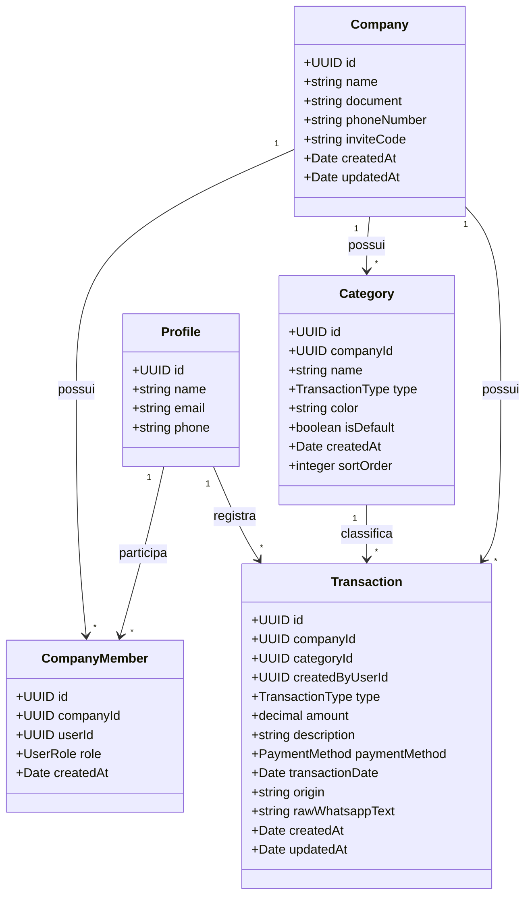
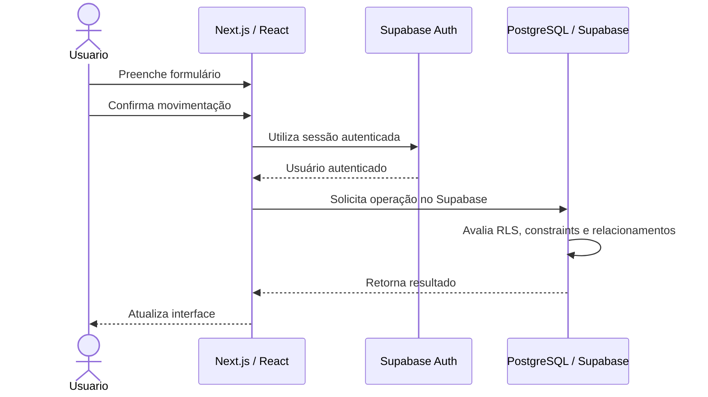
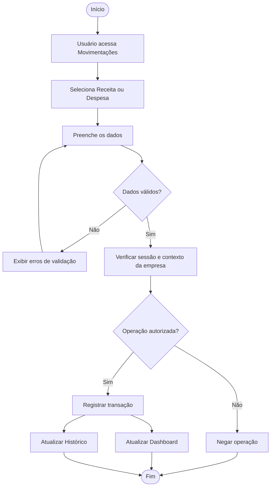
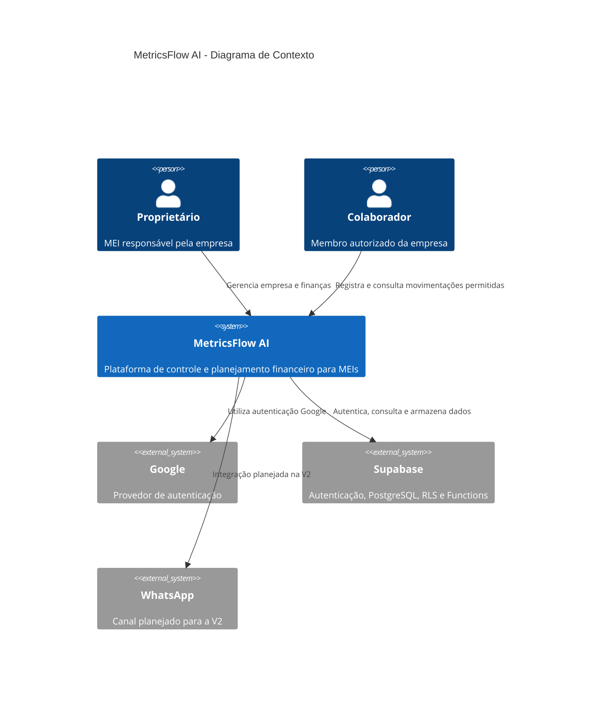
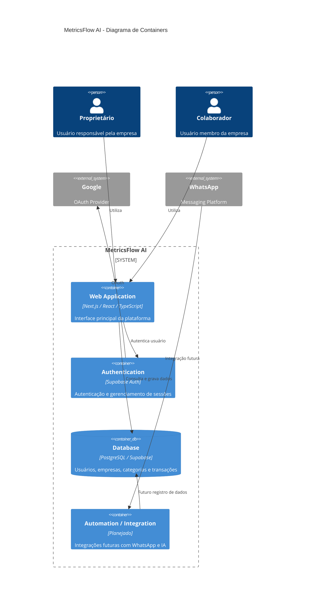

# MetricsFlow AI

> **CPM — Controle e Planejamento Financeiro para MEIs**

O **MetricsFlow AI** é uma plataforma web de gestão financeira desenvolvida para **Microempreendedores Individuais (MEIs)**, com o objetivo de simplificar o controle financeiro e proporcionar uma visão clara da saúde financeira do negócio.

A plataforma centraliza **receitas, despesas, categorias, histórico financeiro, indicadores e DRE**, permitindo que o empreendedor acompanhe seus resultados sem depender de planilhas complexas.

A **V1** concentra a estrutura principal da plataforma: autenticação, gerenciamento de empresas, controle de usuários, movimentações financeiras, dashboard, DRE e controle de acesso.

A arquitetura foi preparada para futuras evoluções envolvendo **WhatsApp e Inteligência Artificial**, previstas para a V2.

---

# 🎯 Objetivo

O objetivo do MetricsFlow AI é oferecer ao MEI uma ferramenta simples, visual e acessível para:

- Registrar receitas;
- Registrar despesas;
- Organizar movimentações por categorias;
- Consultar o histórico financeiro;
- Filtrar movimentações;
- Editar transações;
- Excluir transações;
- Visualizar receitas, custos e despesas;
- Acompanhar o resultado financeiro;
- Analisar a evolução financeira através de gráficos;
- Visualizar uma DRE simplificada;
- Gerenciar informações da empresa;
- Gerenciar informações pessoais;
- Configurar preferências da plataforma;
- Trabalhar com diferentes níveis de acesso;
- Preparar a plataforma para futuras integrações com WhatsApp e IA.

---

# 🚀 Funcionalidades

## 📊 Dashboard

O dashboard apresenta uma visão geral da situação financeira da empresa.

Entre os principais indicadores estão:

- Faturamento;
- Receitas;
- Despesas;
- Lucro;
- Margem;
- Quantidade de movimentações;
- Evolução financeira;
- Gráficos;
- Resumo das movimentações;
- Transações recentes;
- Ações rápidas.

Os dados são organizados de acordo com a empresa vinculada ao usuário autenticado.

---

# 💰 Movimentações

A área de movimentações concentra o gerenciamento das entradas e saídas financeiras.

## Receitas

É possível registrar uma nova receita informando:

- Descrição;
- Valor;
- Categoria;
- Forma de pagamento;
- Data.

## Despesas

O mesmo fluxo é utilizado para registrar despesas.

## Histórico

As movimentações são apresentadas em uma tabela contendo:

- Tipo;
- Descrição;
- Categoria;
- Forma de pagamento;
- Data;
- Valor.

Também existem recursos para:

- Busca;
- Filtro por tipo;
- Filtro por categoria;
- Filtro por período;
- Edição;
- Exclusão.

Os valores monetários são apresentados no padrão brasileiro de moeda, enquanto os valores internos utilizados pelo banco permanecem em formato numérico.

---

# 📈 DRE

A página de **DRE — Demonstração do Resultado do Exercício** apresenta uma visão consolidada do desempenho financeiro da empresa.

A estrutura contempla:

- Receita;
- Custos;
- Despesas;
- Resultado;
- Distribuição por categorias;
- Comparação de indicadores;
- Gráficos;
- Seleção de período;
- Análise por mês e por ano;
- Período personalizado.

A DRE foi estruturada de maneira desacoplada, permitindo que os dados sejam processados separadamente da apresentação visual.

O período pode considerar diferentes opções, como mês atual, mês anterior, trimestre, ano e intervalo personalizado.

---

# 👤 Perfil

A área de perfil permite que o usuário visualize e gerencie suas informações pessoais.

Atualmente contempla:

- Nome;
- E-mail;
- Telefone;
- Informações relacionadas à conta;
- Segurança.

A autenticação dos usuários é realizada através do **Supabase Auth**.

---

# 🏢 Empresa

A área de empresa concentra as informações relacionadas à organização.

A estrutura contempla:

- Dados da empresa;
- Dados cadastrais;
- Membros;
- Código de convite;
- Gerenciamento da equipe;
- Papéis de acesso.

O sistema trabalha atualmente com dois papéis principais.

### Proprietário

Possui acesso administrativo à empresa e às funcionalidades restritas, incluindo operações de gerenciamento de movimentações.

### Colaborador

Pode utilizar as funcionalidades financeiras liberadas para membros da empresa, mas não possui os mesmos privilégios administrativos do proprietário.

As permissões de interface são refletidas no frontend, enquanto as regras de autorização devem ser garantidas na camada de dados por meio das políticas de acesso e demais mecanismos de segurança do Supabase.

---

# ⚙️ Preferências

A área de preferências concentra configurações relacionadas à experiência de utilização da plataforma.

Entre elas:

- Aparência;
- Notificações;
- Preferências financeiras;
- Configurações relacionadas à conta;
- Área para ações sensíveis.

---

# 🔐 Autenticação

O sistema utiliza autenticação através do **Supabase Auth**.

A estrutura atual contempla:

- Login;
- Cadastro;
- Login com Google;
- Callback de autenticação;
- Recuperação de senha;
- Redefinição de senha;
- Persistência da sessão;
- Controle do usuário autenticado.

O sistema identifica o vínculo entre o usuário autenticado e sua empresa através da tabela `company_members`.

---

# 👥 Controle de acesso

O acesso às funcionalidades é determinado pelo papel do usuário dentro da empresa.

```text
owner
 │
 ├── Dashboard
 ├── Movimentações
 ├── DRE
 ├── Perfil
 ├── Empresa
 └── Preferências

collaborator
 │
 ├── Dashboard
 ├── Movimentações
 ├── Perfil
 └── Preferências
```

Uma das regras de negócio do sistema é que o **colaborador não possui os mesmos privilégios administrativos do proprietário**, incluindo as operações restritas de alteração e exclusão de movimentações.

O frontend apresenta ou oculta ações de acordo com a role, mas a autorização definitiva deve ser garantida pelo banco através de RLS e/ou funções adequadas.

---

# 📱 WhatsApp

A integração com WhatsApp faz parte da evolução planejada para a **V2**.

A proposta é permitir que o MEI possa registrar movimentações financeiras através de mensagens.

O fluxo planejado é:

```text
Usuário
   ↓
WhatsApp
   ↓
Webhook
   ↓
Backend / serviço de integração
   ↓
Inteligência Artificial
   ↓
Interpretação da mensagem
   ↓
Dados estruturados
   ↓
Validação
   ↓
Supabase
   ↓
Movimentação financeira
   ↓
Dashboard
```

A funcionalidade ainda não faz parte do fluxo financeiro principal da V1.

---

# 🤖 Inteligência Artificial

A utilização de inteligência artificial está planejada para a segunda fase do projeto.

A IA deverá interpretar mensagens enviadas pelo usuário e identificar informações financeiras.

Exemplo:

```text
Usuário:
"Recebi 850 reais de um projeto de criação de site hoje"
```

A informação poderá ser transformada em uma estrutura semelhante a:

```json
{
  "type": "income",
  "amount": 850,
  "description": "Projeto de criação de site",
  "category": "Serviços",
  "date": "2026-08-28"
}
```

Depois disso, os dados deverão passar por validação antes de serem registrados no banco.

A proposta da V2 é utilizar APIs de inteligência artificial existentes, sem necessidade de treinamento de um modelo próprio.

---

# 🏗️ Arquitetura do projeto

O projeto utiliza **Next.js com App Router**, organizando páginas, componentes, hooks, contextos e recursos por domínio funcional.

A V1 utiliza o Supabase como infraestrutura principal de autenticação e dados. O frontend se comunica com os serviços do Supabase, enquanto regras de autorização e integridade são apoiadas por **RLS, Functions, Triggers, constraints e relacionamentos do PostgreSQL**.

Estrutura simplificada:

```text
metricsflow-ai/
│
├── public/
│
├── src/
│   │
│   ├── app/
│   │   ├── (auth)/
│   │   ├── api/
│   │   ├── auth/
│   │   │   └── callback/
│   │   ├── dashboard/
│   │   ├── demo/
│   │   ├── dre/
│   │   ├── empresa/
│   │   ├── movimentacoes/
│   │   ├── onboarding/
│   │   ├── perfil/
│   │   ├── preferencias/
│   │   ├── recuperar-senha/
│   │   ├── redefinir-senha/
│   │   ├── whatsapp/
│   │   ├── globals.css
│   │   ├── layout.tsx
│   │   └── page.tsx
│   │
│   ├── components/
│   ├── constants/
│   ├── contexts/
│   ├── data/
│   ├── hooks/
│   ├── lib/
│   ├── services/
│   ├── types/
│   ├── utils/
│   └── tests/
│       └── e2e/
│
├── supabase/
│   └── database/
│       ├── tables/
│       ├── functions/
│       ├── triggers/
│       └── rls/
│
├── proxy.ts
├── .env.local
├── .gitignore
├── eslint.config.mjs
├── LICENSE
├── next-env.d.ts
├── next.config.ts
├── package.json
├── postcss.config.mjs
├── playwright.config.ts
├── README.md
├── tailwind.config.ts
└── tsconfig.json
```

> `.next`, `node_modules` e `.env.local` não devem ser versionados no Git. O `.env.local` contém configurações sensíveis do ambiente.

---

# 🧩 Organização da aplicação

## `src/app`

Contém as páginas e rotas da aplicação utilizando o App Router do Next.js.

Principais áreas:

```text
app/
├── (auth)/
├── dashboard/
├── demo/
├── dre/
├── empresa/
├── movimentacoes/
├── onboarding/
├── perfil/
├── preferencias/
└── whatsapp/
```

## `src/components`

Contém os componentes reutilizáveis da interface.

A organização por componentes permite separar elementos como cards, tabelas, formulários, gráficos, modais, seletores e elementos de navegação.

## `src/contexts`

Contém os contextos globais da aplicação.

Um dos principais contextos está relacionado ao usuário autenticado e ao vínculo com a empresa.

```text
Auth
 ↓
Usuário
 ↓
Empresa
 ↓
Role
 ↓
Permissões
```

## `src/data`

Contém dados estáticos e estruturas utilizadas principalmente para desenvolvimento e apresentação.

## `src/hooks`

Contém hooks personalizados utilizados para encapsular comportamentos e estados reutilizáveis.

A separação permite manter os componentes mais focados na apresentação e composição da interface.

## `src/lib`

Contém funções auxiliares, configurações e integrações utilizadas pela aplicação, incluindo a configuração do cliente Supabase.

## `src/types`

Contém tipos TypeScript compartilhados entre diferentes partes da aplicação.

## `src/tests`

Contém os testes automatizados do projeto.

Atualmente a aplicação possui uma estrutura inicial de testes **E2E com Playwright**, utilizada para validar fluxos da interface e da autenticação.

---

# 🗄️ Banco de dados

O banco utiliza **Supabase / PostgreSQL**.

A estrutura principal é baseada nas seguintes entidades:

```text
profiles
    │
    ▼
company_members
    │
    ▼
companies
    │
    ├───────────────┐
    ▼               ▼
categories     transactions
                    │
                    └── campos preparados para integração futura com WhatsApp
```

A tabela `whatsapp_messages` é uma entidade planejada para a evolução da integração com WhatsApp e não deve ser considerada parte do fluxo financeiro principal da V1 enquanto sua estrutura não estiver efetivamente implantada.

---

# 🏢 Empresas

A tabela `companies` representa as empresas cadastradas na plataforma.

Principais informações:

- ID;
- Nome;
- Documento;
- Telefone;
- Código de convite;
- Data de criação;
- Data de atualização.

Cada empresa possui suas próprias categorias e movimentações.

---

# 👥 Membros

A tabela `company_members` relaciona usuários às empresas.

Cada membro possui um papel:

```text
owner
collaborator
```

A relação utiliza principalmente:

```text
company_id
user_id
role
```

Existe uma restrição parcial que impede que o mesmo usuário seja proprietário de mais de uma empresa, de acordo com a estrutura atual do banco.

---

# 🗂️ Categorias

As categorias são relacionadas diretamente à empresa.

Cada categoria possui:

- ID;
- Empresa;
- Nome;
- Tipo;
- Cor;
- Indicador de categoria padrão;
- Data de criação;
- Ordem de exibição.

O tipo da categoria diferencia:

```text
income
expense
```

Ao criar uma empresa, categorias padrão podem ser criadas automaticamente através de uma trigger e uma PostgreSQL Function.

---

# 💸 Transações

A tabela `transactions` representa as movimentações financeiras realizadas pela empresa.

Uma transação possui informações como:

- ID;
- Empresa;
- Categoria;
- Usuário responsável pelo registro;
- Tipo;
- Valor;
- Descrição;
- Forma de pagamento;
- Data da movimentação;
- Origem;
- Texto original do WhatsApp, quando aplicável;
- Data de criação;
- Data de atualização.

A tabela possui integridade referencial com empresas e categorias e também possui uma restrição que impede valores menores ou iguais a zero.

As transações alimentam:

- Dashboard;
- Histórico;
- DRE;
- Gráficos;
- Indicadores financeiros.

---

# 🔒 Segurança

A arquitetura do projeto considera o isolamento dos dados por empresa.

São utilizados conceitos como:

- Autenticação;
- Controle de membros;
- Papéis de acesso;
- Isolamento por empresa;
- Row Level Security (RLS);
- PostgreSQL Functions;
- PostgreSQL Triggers;
- Constraints;
- Foreign Keys;
- Validação de dados;
- Integridade referencial;
- Controle das operações financeiras.

O frontend pode realizar validações para melhorar a experiência do usuário, como campos obrigatórios, formatação e mensagens de erro.

As regras de autorização e integridade que não podem depender da confiança no navegador devem ser garantidas na camada de dados, através de RLS, Functions, constraints e outros mecanismos adequados.

Exemplo de regra de negócio:

```text
Colaborador
   ↓
Pode consultar e registrar conforme as permissões
   ↓
Não possui os privilégios administrativos do proprietário
```

---

# 🧠 Functions e regras de negócio do Supabase

A camada de banco possui funções PostgreSQL utilizadas para centralizar comportamentos relacionados à autenticação, empresas, membros e categorias.

Entre os comportamentos existentes ou estruturados estão:

- Verificação de proprietário da empresa;
- Verificação de membro da empresa;
- Identificação da empresa do usuário autenticado;
- Identificação do papel do usuário;
- Criação de empresa durante o onboarding;
- Associação do usuário como proprietário;
- Entrada em uma empresa através de código de convite;
- Verificação de informações do usuário;
- Criação automática de categorias padrão;
- Criação ou atualização automática de perfil após cadastro;
- Atualização automática de `updated_at`.

As Functions complementam as políticas de RLS e os mecanismos de integridade do PostgreSQL.

---

# 🏷️ Categorias padrão

Ao criar uma nova empresa, uma trigger executa automaticamente a função responsável por criar categorias padrão.

### Receitas

- Vendas / Produtos;
- Prestação de Serviços;
- Outras Receitas.

### Despesas

- Fornecedores / Estoque;
- Aluguel / Água / Luz;
- Marketing / Anúncios;
- DAS / Impostos MEI;
- Ferramentas / Sistema;
- Outras Despesas.

Essas categorias são associadas automaticamente à empresa recém-criada.

---

# 👤 Criação automática de perfil

Após a criação de um usuário no Supabase Auth, uma trigger pode executar a função responsável por criar ou atualizar o registro correspondente na tabela `profiles`.

O processo utiliza informações disponíveis no usuário, como:

- ID;
- E-mail;
- Nome informado no cadastro.

A criação da empresa não é realizada nesse processo.

A empresa é criada posteriormente através do fluxo de onboarding.

---

# 🔑 Row Level Security — RLS

O banco utiliza **Row Level Security (RLS)** para restringir o acesso aos dados de acordo com o vínculo do usuário autenticado com a empresa.

A autorização é baseada principalmente na relação:

```text
auth.uid()
     ↓
company_members
     ↓
company_id
     ↓
dados da empresa
```

Dessa forma, as políticas podem restringir o acesso aos registros pertencentes às empresas das quais o usuário é membro.

As políticas de segurança estão relacionadas principalmente a:

- `companies`;
- `company_members`;
- `categories`;
- `transactions`;
- `profiles`.

> As regras definitivas devem ser mantidas no banco. O frontend não deve ser considerado a camada final de segurança.

---

# 📐 UML

A modelagem da aplicação utiliza diagramas para representar os principais comportamentos e estruturas do sistema.

## Diagrama de Caso de Uso



---

# 📦 Diagrama de Classes



---

# 🔄 Diagrama de Sequência

O fluxo abaixo representa o registro de uma movimentação na arquitetura atual da V1.



---

# ⚙️ Diagrama de Atividade

O fluxo representa o processo de cadastro de uma movimentação.



---

# 🏛️ C4 Model

A arquitetura também pode ser representada utilizando o **C4 Model**.

## Diagrama de Contexto — C4



## Diagrama de Containers — C4



---

# 🧱 Stack

## Frontend

- **Next.js**
- **React**
- **TypeScript**
- **Tailwind CSS**
- **Framer Motion**
- **Lucide React**
- **React Day Picker**
- **Recharts**

## Backend / Infraestrutura

- **Supabase**
- **PostgreSQL**
- **Supabase Auth**
- **Row Level Security (RLS)**
- **PostgreSQL Functions**
- **PostgreSQL Triggers**
- **PostgreSQL Constraints**

## Testes

- **Playwright**

## Desenvolvimento

- **ESLint**
- **TypeScript**
- **Git / GitHub**

## Futuras integrações

- WhatsApp API;
- Webhooks;
- API de Inteligência Artificial;
- Processamento automatizado de mensagens.

---

# 🧪 Testes E2E

O projeto utiliza **Playwright** para testes end-to-end.

Os primeiros testes estão concentrados nos fluxos da autenticação e na validação do comportamento da interface.

Executar todos os testes:

```bash
npm run test:e2e
```

Executar com o navegador visível:

```bash
npx playwright test --headed --workers=1
```

Executar uma suíte específica:

```bash
npx playwright test tests/e2e/auth.spec.ts
```

Durante o desenvolvimento, `--workers=1` pode ser utilizado para executar os testes de forma sequencial e facilitar a visualização do navegador.

A expansão da cobertura para dashboard, movimentações, DRE e permissões faz parte da evolução dos testes.

---

# 🛠️ Instalação

Clone o repositório:

```bash
git clone https://github.com/Rayck4dev/MetricsFlow_AI
```

Entre no diretório:

```bash
cd metricsflow-ai
```

Instale as dependências:

```bash
npm install
```

Crie o arquivo de variáveis de ambiente:

```text
.env.local
```

Configure as variáveis necessárias para o Supabase de acordo com o ambiente utilizado.

Execute o projeto em desenvolvimento:

```bash
npm run dev
```

A aplicação ficará disponível normalmente em:

```text
http://localhost:3000
```

Para executar o build de produção:

```bash
npm run build
```

Para iniciar a aplicação construída:

```bash
npm run start
```

---

# 📌 Status da V1

## Frontend

- [x] Dashboard
- [x] Header
- [x] Cards financeiros
- [x] Gráficos
- [x] Resumo financeiro
- [x] Transações recentes
- [x] Ações rápidas
- [x] Movimentações
- [x] Cadastro de receitas
- [x] Cadastro de despesas
- [x] Edição de transações
- [x] Exclusão de transações
- [x] Filtros financeiros
- [x] Histórico de movimentações
- [x] DRE
- [x] Seleção de períodos na DRE
- [x] Perfil
- [x] Empresa
- [x] Preferências
- [x] Onboarding
- [x] Login
- [x] Cadastro
- [x] Login com Google
- [x] Recuperação de senha
- [x] Redefinição de senha
- [x] Controle de acesso por papel
- [x] Área de demonstração
- [x] Calendário customizado para movimentações
- [x] Estrutura inicial do WhatsApp

## Backend / Dados

- [x] Supabase configurado
- [x] PostgreSQL
- [x] Supabase Auth
- [x] Perfis
- [x] Empresas
- [x] Membros
- [x] Papéis de acesso
- [x] Categorias
- [x] Transações
- [x] Relacionamentos
- [x] PostgreSQL Functions
- [x] PostgreSQL Triggers
- [x] Row Level Security
- [x] Políticas de segurança
- [x] Isolamento de dados por empresa
- [x] Integração frontend + Supabase

## Testes

- [x] Configuração inicial do Playwright
- [x] Primeiros testes E2E de autenticação
- [ ] Testes E2E de movimentações
- [ ] Testes E2E da DRE
- [ ] Testes E2E completos de permissões

## DevOps / CI/CD

- [x] Versionamento com Git
- [x] Repositório GitHub
- [x] Deploy com Vercel
- [ ] Pipeline de CI automatizado
- [ ] Execução automática dos testes E2E no GitHub Actions

---

# 🚀 Roadmap

## V1 — Plataforma Financeira

```text
Planejamento
     ↓
Design
     ↓
Arquitetura
     ↓
Frontend
     ↓
Autenticação
     ↓
Banco de Dados
     ↓
Integração Supabase
     ↓
Dashboard
     ↓
Movimentações
     ↓
DRE
     ↓
Controle de acesso
     ↓
Testes
     ↓
Entrega
```

---

# 🤖 V2 — Inteligência e Automação

A segunda fase do projeto tem como objetivo transformar o MetricsFlow AI em um assistente financeiro mais automatizado.

## Prioridades iniciais da V2

- [ ] Melhorar o onboarding;
- [ ] Capturar as informações do onboarding e persistir no Supabase;
- [ ] Estruturar preferências do sistema;
- [ ] Implementar suporte a tema claro;
- [ ] Implementar modo de tema do sistema;
- [ ] Estruturar notificações;
- [ ] Evoluir a arquitetura de serviços e regras de negócio;
- [ ] Iniciar a camada de inteligência artificial.

## WhatsApp

- [ ] Configurar API/WhatsApp;
- [ ] Configurar webhook;
- [ ] Receber mensagens;
- [ ] Processar mensagens;
- [ ] Identificar usuário;
- [ ] Identificar empresa;
- [ ] Registrar histórico das mensagens.

## Inteligência Artificial

- [ ] Integrar API de IA;
- [ ] Criar prompt estruturado;
- [ ] Utilizar saída estruturada em JSON;
- [ ] Identificar tipo da movimentação;
- [ ] Identificar valor;
- [ ] Identificar descrição;
- [ ] Identificar categoria;
- [ ] Identificar data;
- [ ] Validar informações recebidas.

## Backend / Integrações

- [ ] Criar fluxo de processamento;
- [ ] Validar resposta da IA;
- [ ] Executar inserção no Supabase;
- [ ] Retornar confirmação;
- [ ] Criar tratamento de erros;
- [ ] Criar logs;
- [ ] Integrar processamento com WhatsApp.

## Dashboard

- [ ] Atualização após lançamento via WhatsApp;
- [ ] Histórico de lançamentos automatizados;
- [ ] Identificação da origem da movimentação;
- [ ] Indicadores de automação.

---

# 🧠 Visão futura

O MetricsFlow AI pretende evoluir de uma plataforma de controle financeiro para um **assistente de gestão financeira voltado para MEIs**.

A evolução planejada inclui:

- Registro financeiro via WhatsApp;
- Automação de lançamentos;
- Interpretação de mensagens;
- Análise financeira inteligente;
- Alertas;
- Insights sobre receitas e despesas;
- Auxílio na interpretação da DRE;
- Recomendações baseadas no comportamento financeiro.

A proposta é reduzir a complexidade da gestão financeira para empreendedores que precisam administrar o próprio negócio sem necessariamente possuir conhecimentos avançados de contabilidade ou gestão financeira.

---

# 👤 Matriz de papéis acumulados

O MetricsFlow AI é desenvolvido individualmente. Dessa forma, todas as áreas necessárias para o desenvolvimento do projeto são acumuladas pela mesma desenvolvedora.

| Papel                | Responsabilidades                                                                                          |
| -------------------- | ---------------------------------------------------------------------------------------------------------- |
| **Gestão / Produto** | Levantamento de requisitos, definição de funcionalidades, organização das tarefas e priorização do projeto |
| **UI/UX**            | Arquitetura visual, experiência de navegação, identidade visual, responsividade e componentes              |
| **Frontend**         | Desenvolvimento das páginas, componentização, estados, interações, validações de UX e integração com dados |
| **Backend**          | Estruturação de integrações, regras de negócio e serviços de dados                                         |
| **Banco de Dados**   | Modelagem, relacionamentos, políticas de acesso, integridade, Functions e Triggers                         |
| **QA / Testes**      | Testes funcionais, E2E, validação dos fluxos, identificação e correção de bugs                             |
| **Documentação**     | README, documentação técnica, diagramas, organização do projeto e registro das decisões                    |
| **DevOps / Deploy**  | Versionamento, build, deploy, variáveis de ambiente e infraestrutura                                       |

## Desenvolvimento individual

Por se tratar de um projeto desenvolvido individualmente, as diferentes responsabilidades são acumuladas ao longo das etapas do projeto.

Essa abordagem permite que decisões de **produto, design, desenvolvimento, banco de dados, testes, documentação e deploy** sejam centralizadas durante a construção do MetricsFlow AI.

---

# 📋 Papéis considerados

## Gestão / Produto

- Levantamento de requisitos;
- Organização das tarefas;
- Definição de funcionalidades;
- Priorização;
- Planejamento das versões.

## UI/UX

- Estrutura visual;
- Experiência de navegação;
- Componentes;
- Responsividade;
- Identidade visual.

## Frontend

- Desenvolvimento das páginas;
- Componentização;
- Integração com dados;
- Estados;
- Interações;
- Validações de experiência do usuário.

## Backend

- APIs e integrações quando necessárias;
- Regras de negócio;
- Autenticação;
- Integrações;
- Segurança.

## Banco de Dados

- Modelagem;
- Relacionamentos;
- Índices;
- Políticas de acesso;
- Functions;
- Triggers;
- Constraints;
- Integridade dos dados.

## QA / Testes

- Testes funcionais;
- Testes E2E;
- Identificação de bugs;
- Validação de fluxos;
- Testes de integração;
- Regressão.

## Documentação

- README;
- Documentação técnica;
- Diagramas;
- Organização do projeto;
- Registro das decisões.

## DevOps / Deploy

- Configuração do ambiente;
- Versionamento;
- Build;
- Deploy;
- Configuração de variáveis de ambiente;
- Infraestrutura.

---

# 🗺️ Roadmap geral

```text
                         METRICSFLOW AI
                               │
                ┌──────────────┴──────────────┐
                │                             │
               V1                            V2
                │                             │
       Gestão financeira              Automação + IA
                │                             │
       ├── Autenticação                ├── Onboarding evoluído
       ├── Empresas                    ├── Preferências
       ├── Membros                     ├── Notificações
       ├── Categorias                  ├── WhatsApp
       ├── Transações                   ├── Webhook
       ├── Dashboard                    ├── IA
       ├── DRE                          ├── Structured Output
       └── Segurança                    ├── Processamento
                                        └── Insights
```

---

# 📂 Estrutura da documentação do Supabase

Os scripts relacionados ao banco de dados podem ser organizados da seguinte forma:

```text
supabase/
│
└── database/
    │
    ├── tables/
    │   ├── profiles.sql
    │   ├── companies.sql
    │   ├── company_members.sql
    │   ├── categories.sql
    │   └── transactions.sql
    │
    ├── functions/
    │   ├── is_company_owner.sql
    │   ├── create_company.sql
    │   ├── get_user_company.sql
    │   ├── get_user_role.sql
    │   ├── get_company_members.sql
    │   ├── create_company_categories.sql
    │   ├── handle_new_user.sql
    │   ├── is_company_member.sql
    │   ├── is_company_owner_by_id.sql
    │   ├── join_company_by_invite.sql
    │   └── update_updated_at.sql
    │
    ├── triggers/
    │   ├── trigger_seed_company_categories.sql
    │   ├── trigger_handle_new_user.sql
    │   └── trigger_update_updated_at.sql
    │
    └── rls/
        ├── profiles.sql
        ├── companies.sql
        ├── company_members.sql
        ├── categories.sql
        └── transactions.sql
```

Essa organização separa a estrutura do banco, funções, triggers e políticas de segurança, facilitando a manutenção e a reprodução do ambiente.

> Os arquivos dessa estrutura devem conter o SQL efetivamente utilizado no projeto. Não devem ser considerados implementados apenas por estarem listados no README.

---

# 📄 Licença

Este projeto está licenciado sob a **MIT License**.

Consulte o arquivo [`LICENSE`](./LICENSE) para obter os termos completos da licença.

---

# 🎯 MetricsFlow AI

**Controle. Analise. Cresça.**

Projeto desenvolvido como solução de **Controle e Planejamento Financeiro (CPM) para MEIs**.

A **V1** concentra a estrutura principal de gestão financeira da plataforma.

A **V2** terá como foco a evolução do produto, automação, WhatsApp e Inteligência Artificial.
