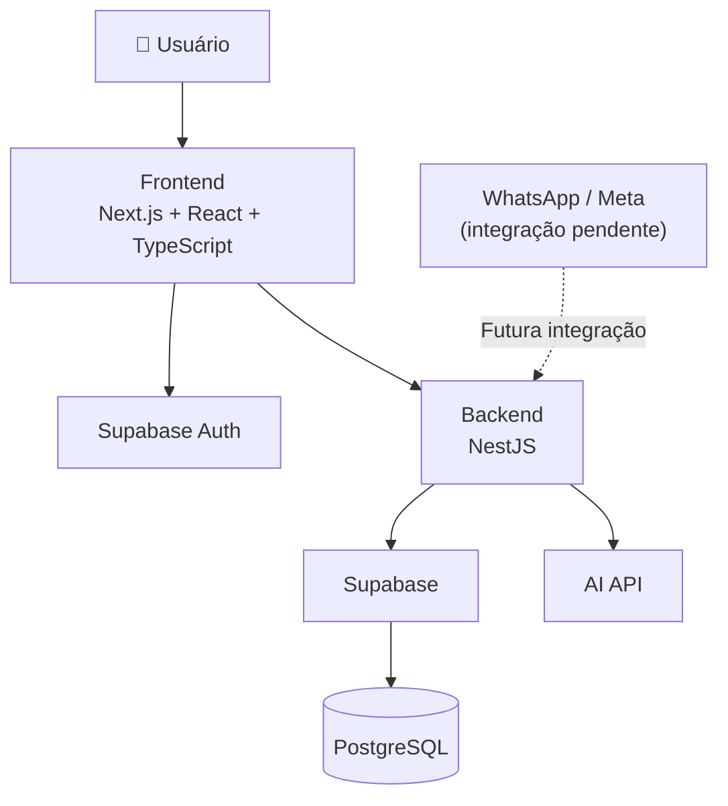
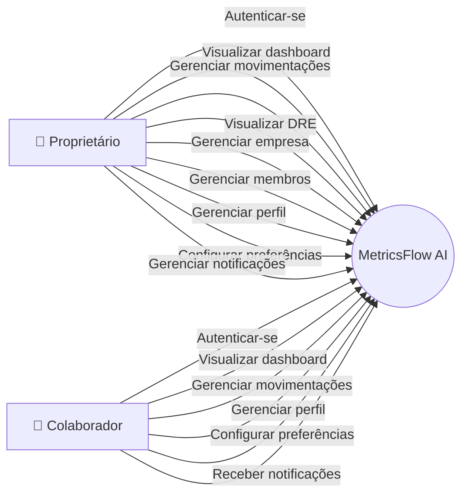
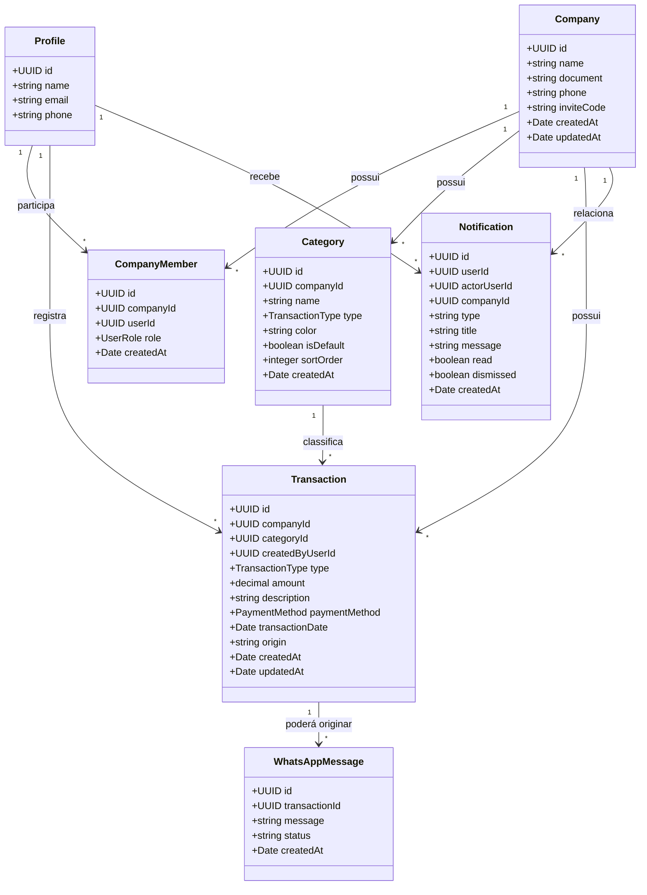
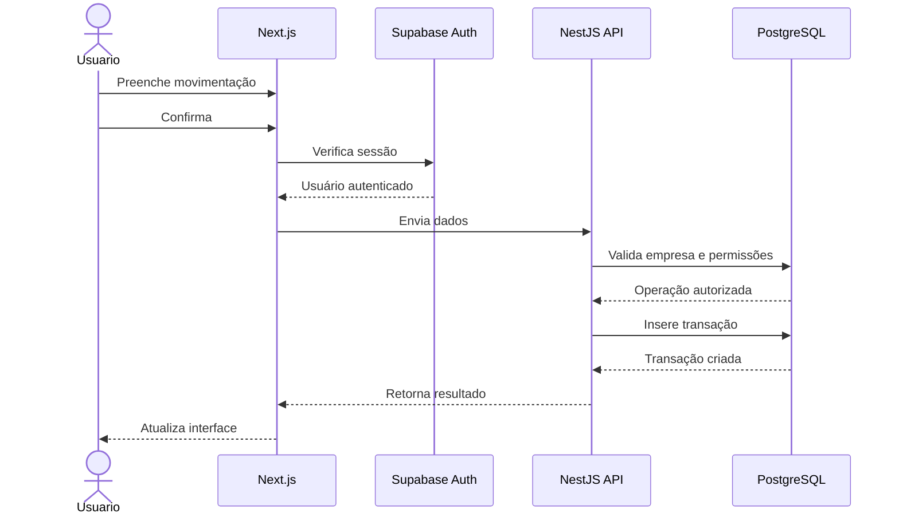
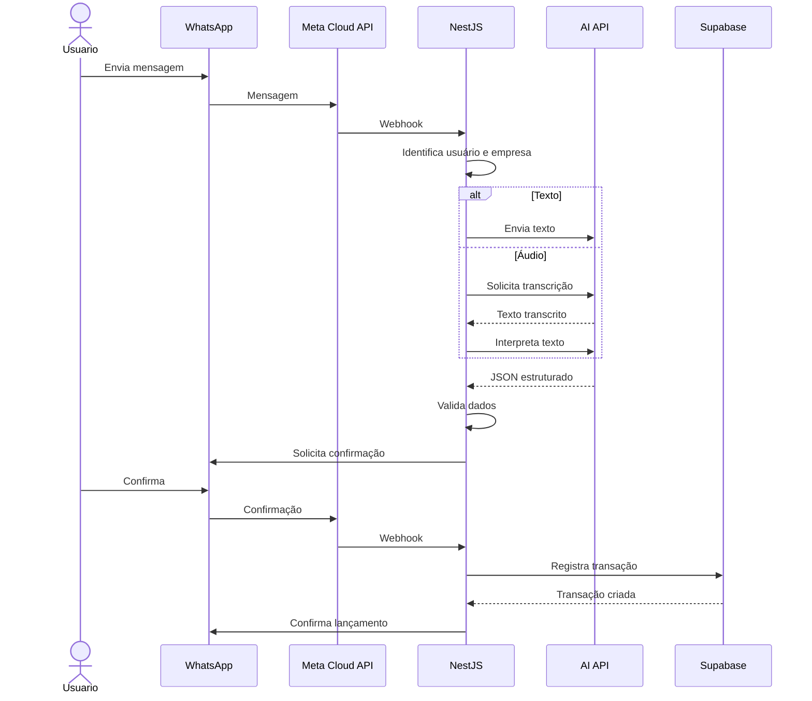
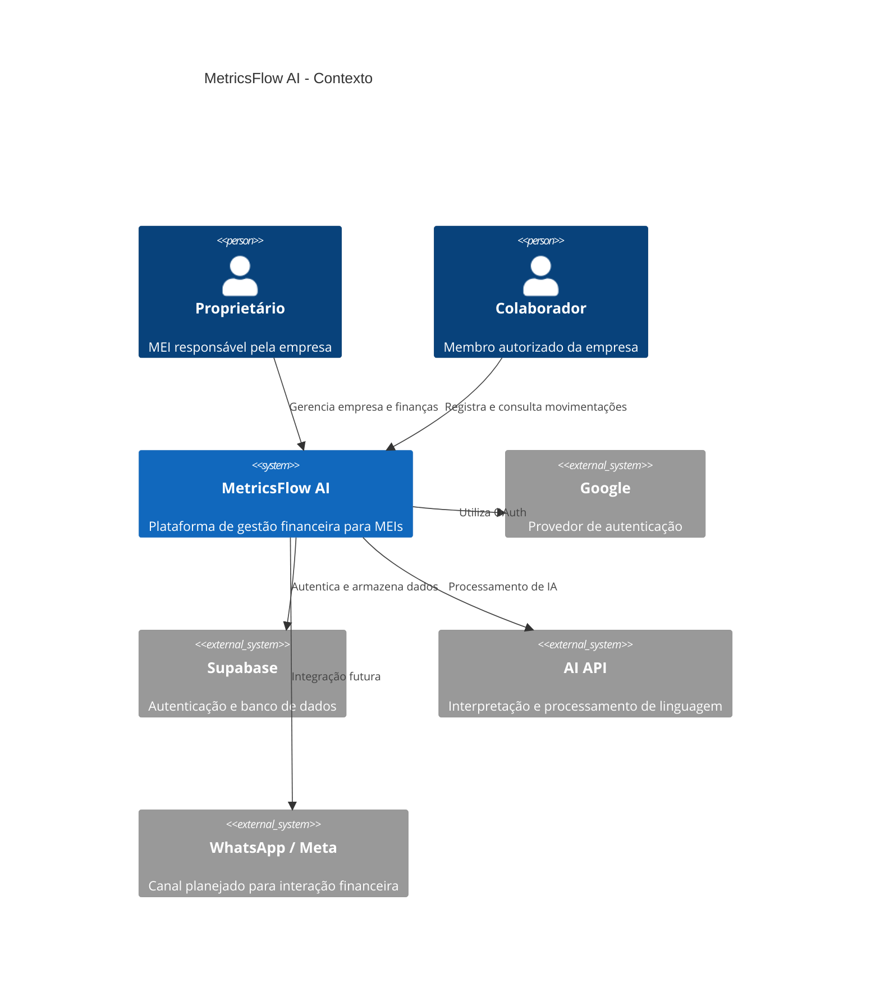
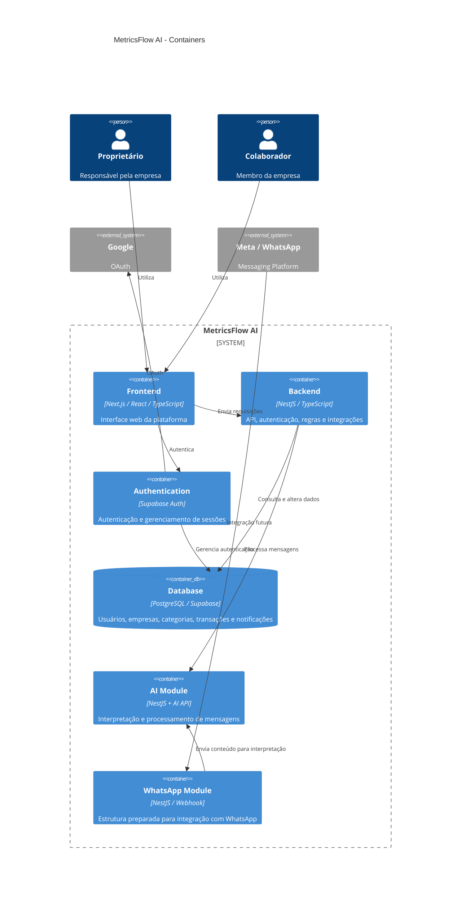
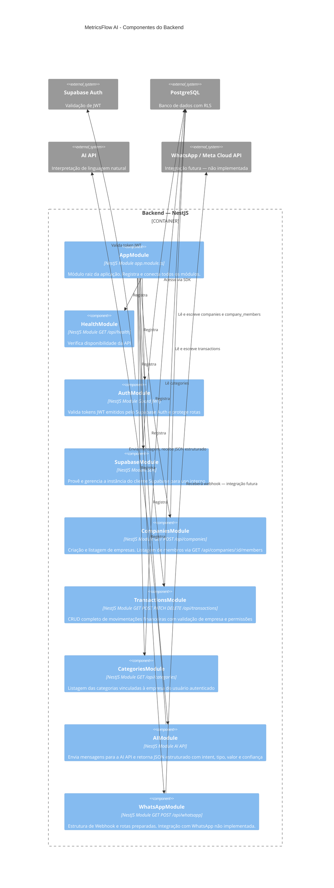

<p align="center">
  
</p>

<p align="center">
  
  
  
  
  
  
  
  
  
  
  
  
  
  
  
  
  
</p>

# MetricsFlow AI

> **CPM — Controle e Planejamento Financeiro para MEIs**

**Você conversa. A MetricsFlow organiza.**


A **MetricsFlow AI** é uma plataforma de gestão financeira desenvolvida para **Microempreendedores Individuais (MEIs)**, com foco em simplificar o controle das movimentações financeiras e oferecer uma visão clara da saúde financeira do negócio.

A plataforma centraliza **receitas, despesas, categorias, histórico financeiro, indicadores, DRE, empresas, usuários e preferências**, permitindo que o empreendedor acompanhe seus resultados sem depender de planilhas complexas.

A V1 estabeleceu a plataforma web de gestão financeira. A V2 evolui essa estrutura com uma arquitetura baseada em **frontend + backend**, preparando o sistema para recursos de inteligência artificial e integração com WhatsApp.

---

# Links da Documentação Acadêmica 📚

## Gerenciamento de Recursos Humanos

[🔗 Atividade Prática — Gerenciamento de RH](https://www.notion.so/Atividade-Pr-tica-Gerenciamento-de-RH-3ce2ae5e90d1803e8a62fa80af5b79b1?source=copy_link)

## Gerenciamento de Qualidade de Software

[🔗 Atividade Prática — Gerenciamento de Qualidade de Software](https://www.notion.so/Atividade-Pr-tica-Gerenciamento-de-Qualidade-de-Software-3db2ae5e90d18085ad46d38adf9928b6?source=copy_link)

## Elaboração BMC e Proposta de Valor

[🔗 Atividade Prática Elaboração BMC e Proposta de Valor](https://www.notion.so/Atividade-Pr-tica-Elabora-o-BMC-e-Proposta-de-Valor-3e32ae5e90d180d4bd04fa468ce5541f?source=copy_link)

---

## 💰 Orçamento do projeto

O orçamento e a estimativa financeira do projeto estão disponíveis no documento:

- [📄 Orçamento do projeto](docs/orcamento.pdf)

---

## 🎯 Objetivo

O objetivo do MetricsFlow AI é oferecer ao MEI uma ferramenta simples, visual e acessível para:

- Registrar receitas;
- Registrar despesas;
- Organizar movimentações por categorias;
- Consultar o histórico financeiro;
- Buscar movimentações;
- Filtrar movimentações;
- Editar transações;
- Excluir transações;
- Visualizar receitas, custos e despesas;
- Acompanhar o resultado financeiro;
- Analisar a evolução financeira através de gráficos;
- Visualizar uma DRE simplificada;
- Gerenciar informações da empresa;
- Gerenciar membros da empresa;
- Gerenciar informações pessoais;
- Configurar preferências;
- Controlar diferentes níveis de acesso;
- Receber notificações financeiras;
- Exportar informações financeiras;
- Preparar o sistema para registro financeiro através do WhatsApp;
- Preparar o sistema para interpretação de mensagens utilizando inteligência artificial.

---

# 🚀 Funcionalidades

## 📊 Dashboard

O dashboard apresenta uma visão geral da situação financeira da empresa atualmente selecionada.

Entre os principais indicadores estão:

- Faturamento;
- Receitas;
- Despesas;
- Lucro;
- Margem;
- Quantidade de movimentações;
- Evolução financeira;
- Gráficos;
- Resumo financeiro;
- Transações recentes;
- Ações rápidas.

Os dados são obtidos a partir das movimentações financeiras vinculadas à empresa.

A arquitetura também permite que os dados sejam atualizados conforme novas movimentações são registradas.

---

# 💰 Movimentações

A área de movimentações concentra o gerenciamento das entradas e saídas financeiras.

## Receitas

É possível registrar uma nova receita informando:

- Descrição;
- Valor;
- Categoria;
- Forma de pagamento;
- Data.

## Despesas

O mesmo fluxo é utilizado para registrar despesas.

## Histórico

As movimentações são apresentadas em uma tabela contendo:

- Tipo;
- Descrição;
- Categoria;
- Forma de pagamento;
- Data;
- Valor.

Também estão disponíveis:

- Busca;
- Filtro por tipo;
- Filtro por categoria;
- Filtro por período;
- Edição;
- Exclusão;
- Exportação para CSV.

As movimentações possuem uma origem, permitindo diferenciar registros realizados pela plataforma web de futuras movimentações provenientes de integrações externas.

---

# 📈 DRE

A página de **DRE — Demonstração do Resultado do Exercício** apresenta uma visão consolidada do desempenho financeiro da empresa.

A estrutura contempla:

- Receita;
- Custos;
- Despesas;
- Resultado;
- Margem;
- Distribuição por categorias;
- Comparação de indicadores;
- Gráficos;
- Seleção de período;
- Exportação dos dados para CSV.

A DRE utiliza as movimentações financeiras registradas para calcular os principais indicadores do período selecionado.

---

# 👤 Perfil

A área de perfil permite que o usuário visualize e gerencie suas informações pessoais.

Contempla:

- Nome;
- E-mail;
- Telefone;
- Informações da conta;
- Segurança.

A autenticação e a sessão do usuário são gerenciadas pelo **Supabase Auth**.

---

# 🏢 Empresa

A área de empresa concentra as informações relacionadas à organização.

Contempla:

- Dados da empresa;
- Dados cadastrais;
- Membros;
- Código de convite;
- Gerenciamento da equipe;
- Papéis de acesso.

O sistema utiliza atualmente dois papéis principais:

### Proprietário

Possui acesso administrativo à empresa e às funcionalidades restritas.

### Colaborador

Pode utilizar as funcionalidades financeiras disponibilizadas aos membros, mas possui permissões diferentes das do proprietário.

A autorização é determinada pelo vínculo existente entre o usuário e a empresa através de `company_members`.

---

# ⚙️ Preferências

A área de preferências concentra configurações relacionadas à experiência de utilização da plataforma.

Entre elas:

- Aparência;
- Notificações;
- Preferências financeiras;
- Período financeiro padrão;
- Moeda;
- Configurações relacionadas à conta;
- Área para ações sensíveis.

As preferências financeiras são persistidas no banco de dados.

---

# 🔔 Notificações

O MetricsFlow possui um sistema de notificações integrado ao banco de dados.

As notificações podem informar eventos relacionados às movimentações financeiras e ao funcionamento da plataforma.

A estrutura contempla:

- Notificações por usuário;
- Identificação da empresa;
- Identificação do usuário responsável pela ação;
- Estado de leitura;
- Estado de arquivamento;
- Data de criação;
- Preferências de recebimento.

O sistema diferencia notificações de demonstração das notificações reais do usuário autenticado.

As notificações relacionadas a movimentações respeitam as preferências configuradas pelo usuário.

---

# 🔐 Autenticação

O sistema utiliza **Supabase Auth** para autenticação e gerenciamento de sessões.

A estrutura contempla:

- Login;
- Cadastro;
- Login com Google;
- Callback de autenticação;
- Recuperação de senha;
- Redefinição de senha;
- Persistência da sessão;
- Identificação do usuário autenticado;
- Identificação da empresa vinculada;
- Controle de acesso por papel.

O vínculo entre usuário e empresa é estabelecido através da tabela:

```text
auth.users
    │
    ▼
company_members
    │
    ▼
companies
```

---

# 👥 Controle de acesso

O acesso às funcionalidades é determinado pelo papel do usuário dentro da empresa.

```text
                    Usuário autenticado
                            │
                            ▼
                    company_members
                            │
                 ┌──────────┴──────────┐
                 ▼                     ▼
              owner              collaborator
                 │                     │
                 ▼                     ▼
        Acesso administrativo    Acesso financeiro
```

## Proprietário

Possui acesso a:

- Dashboard;
- Movimentações;
- DRE;
- Perfil;
- Empresa;
- Membros;
- Preferências;
- Operações administrativas.

## Colaborador

Possui acesso a:

- Dashboard;
- Movimentações;
- Perfil;
- Preferências.

Operações administrativas e ações restritas são controladas de acordo com o papel do usuário.

---

# 🧭 Onboarding

O sistema possui um fluxo de onboarding para configuração inicial da empresa.

O processo permite:

```text
Cadastro
   ↓
Autenticação
   ↓
Onboarding
   ↓
Criação / identificação da empresa
   ↓
Vínculo do usuário
   ↓
Configuração inicial
   ↓
Categorias padrão
   ↓
Dashboard
```

A criação da empresa e o vínculo do usuário como proprietário são tratados através das regras do banco e da aplicação.

---

# 🏗️ Arquitetura do projeto

O MetricsFlow utiliza uma arquitetura **monorepo**, contendo frontend e backend no mesmo repositório Git.

```text
metricsflow-ai/
│
├── frontend/
│   └── Next.js
│
├── backend/
│   └── NestJS
│
├── .gitignore
├── README.md
└── LICENSE
```

A separação permite que frontend e backend evoluam de forma independente dentro do mesmo projeto.

---

# 🖥️ Frontend

O frontend é desenvolvido utilizando **Next.js com App Router**, React e TypeScript.

Estrutura simplificada:

```text
frontend/
│
├── src/
│   ├── app/
│   │   ├── (auth)/
│   │   ├── api/
│   │   ├── auth/
│   │   ├── dashboard/
│   │   ├── demo/
│   │   ├── dre/
│   │   ├── empresa/
│   │   ├── movimentacoes/
│   │   ├── onboarding/
│   │   ├── perfil/
│   │   ├── preferencias/
│   │   └── whatsapp/
│   │
│   ├── components/
│   ├── contexts/
│   ├── data/
│   ├── hooks/
│   ├── lib/
│   └── types/
│
├── public/
├── package.json
└── ...
```

---

# ⚙️ Backend

A V2 introduz um backend próprio desenvolvido com **NestJS**.

O backend centraliza APIs, autenticação, regras de negócio e integrações que não devem ficar expostas no frontend.

Estrutura simplificada:

```text
backend/
│
├── src/
│   ├── modules/
│   │   ├── ai/
│   │   ├── auth/
│   │   ├── categories/
│   │   ├── companies/
│   │   ├── health/
│   │   ├── supabase/
│   │   ├── transactions/
│   │   └── whatsapp/
│   │
│   ├── app.module.ts
│   └── main.ts
│
├── .env
├── package.json
└── ...
```

O backend possui prefixo global:

```text
/api
```

Principais rotas atualmente estruturadas:

```text
GET    /api
GET    /api/health
GET    /api/supabase/test

GET    /api/companies
POST   /api/companies
GET    /api/companies/:companyId/members

GET    /api/transactions
POST   /api/transactions
PATCH  /api/transactions/:id
DELETE /api/transactions/:id

GET    /api/categories

GET    /api/whatsapp/connection
POST   /api/whatsapp/connection

POST   /api/whatsapp/demo
POST   /api/whatsapp/confirm

GET    /api/whatsapp/webhook
POST   /api/whatsapp/webhook
```

A estrutura de WhatsApp está preparada no backend, mas a integração efetiva com o WhatsApp ainda não está disponível no fluxo de produção.

---

# 🧠 Inteligência Artificial

A V2 introduz uma camada de inteligência artificial preparada para interpretar mensagens financeiras.

A responsabilidade da IA é **interpretar informações**, e não executar diretamente operações no banco.

Fluxo conceitual:

```text
Mensagem
   ↓
IA
   ↓
JSON estruturado
   ↓
Validação do Backend
   ↓
Regras de negócio
   ↓
Confirmação
   ↓
Banco de dados
```

A estrutura de interpretação contempla informações como:

```json
{
  "intent": "create_transaction",
  "type": "income",
  "amount": 850,
  "description": "Projeto de criação de site",
  "categoryId": null,
  "categoryName": null,
  "paymentMethod": null,
  "transactionDate": null,
  "confidence": 0.95,
  "missingFields": []
}
```

A aplicação deve validar a resposta antes de qualquer persistência.

A IA não deve:

- Criar categorias inexistentes;
- Inventar informações;
- Registrar uma movimentação sem confirmação;
- Ignorar campos obrigatórios;
- Bypassar as regras de autorização.

---

# 📱 WhatsApp

A integração com WhatsApp é a principal funcionalidade ainda pendente da V2.

A arquitetura do backend já possui a estrutura necessária para receber e processar mensagens, porém a integração completa com a plataforma do WhatsApp ainda não está concluída.

O fluxo planejado é:

```text
                 WHATSAPP
                     │
                     ▼
              Meta Cloud API
                     │
                     ▼
                  Webhook
                     │
                     ▼
             NestJS Backend
                     │
                     ▼
             Identificação
             do usuário
                     │
                     ▼
          Identificação da empresa
                     │
                     ▼
          Processamento da mensagem
                     │
              ┌──────┴──────┐
              ▼             ▼
            Texto          Áudio
              │             │
              │       Transcrição
              │             │
              └──────┬──────┘
                     ▼
               IA / Parser
                     │
                     ▼
             Dados estruturados
                     │
                     ▼
               Validação
                     │
                     ▼
              Confirmação
                     │
              ┌──────┴──────┐
              ▼             ▼
          Confirmar       Corrigir/
              │           Cancelar
              ▼
            Supabase
              │
              ▼
          Transação
              │
              ▼
          Dashboard
```

### Regra principal

Nenhuma movimentação deverá ser registrada apenas porque a IA interpretou uma mensagem.

O fluxo previsto exige:

```text
Interpretar
    ↓
Validar
    ↓
Solicitar confirmação
    ↓
Usuário confirma
    ↓
Registrar
```

---

# 🗄️ Banco de dados

O banco de dados utiliza **Supabase / PostgreSQL**.

Principais entidades:

```text
auth.users
    │
    ├── profiles
    │
    └── company_members
             │
             ▼
          companies
             │
       ┌─────┼─────────────┐
       ▼     ▼             ▼
 categories transactions notifications
                  │
                  ▼
          whatsapp_messages
```

## Empresas

Representadas pela tabela:

```text
companies
```

Cada empresa possui suas próprias categorias, membros e movimentações.

## Membros

Representados por:

```text
company_members
```

Relacionam usuários às empresas e armazenam o papel de acesso.

## Categorias

Representadas por:

```text
categories
```

Cada categoria pertence a uma empresa e possui um tipo:

```text
income
expense
```

## Transações

Representadas por:

```text
transactions
```

Uma transação contém informações como:

- Empresa;
- Categoria;
- Usuário responsável;
- Tipo;
- Valor;
- Descrição;
- Forma de pagamento;
- Data;
- Origem;
- Data de criação;
- Data de atualização.

A origem permite identificar, por exemplo:

```text
web
whatsapp
```

A origem `whatsapp` será utilizada quando a integração estiver concluída.

## Notificações

Representadas por:

```text
notifications
```

As notificações são vinculadas ao usuário e podem também estar relacionadas a uma empresa e ao usuário responsável pela ação.

---

# 🏷️ Categorias padrão

Ao criar uma empresa, categorias padrão são disponibilizadas automaticamente.

### Receitas

- Vendas / Produtos;
- Prestação de Serviços;
- Outras Receitas.

### Despesas

- Fornecedores / Estoque;
- Aluguel / Água / Luz;
- Marketing / Anúncios;
- DAS / Impostos MEI;
- Ferramentas / Sistema;
- Outras Despesas.

A estrutura permite que cada empresa possua seu próprio conjunto de categorias.

---

# 🧠 Functions e Triggers

A camada PostgreSQL possui funções e triggers responsáveis por centralizar regras relacionadas ao sistema.

Entre as responsabilidades estão:

- Verificação de proprietário;
- Verificação de membro;
- Identificação da empresa do usuário;
- Identificação do papel do usuário;
- Criação de empresa;
- Associação do usuário como proprietário;
- Entrada em empresa através de convite;
- Criação de categorias padrão;
- Criação automática de perfil;
- Atualização automática de `updated_at`;
- Geração de notificações relacionadas a movimentações.

---

# 🔒 Segurança

A arquitetura utiliza múltiplas camadas de proteção.

São utilizados:

- Supabase Auth;
- Controle de sessão;
- Controle de membros;
- Papéis de acesso;
- Row Level Security;
- Validação de dados;
- Integridade referencial;
- Funções PostgreSQL;
- Triggers;
- Validação no backend;
- Separação de variáveis de ambiente;
- Segredos mantidos no backend.

A relação de autorização principal é:

```text
auth.uid()
    ↓
company_members
    ↓
company_id
    ↓
dados autorizados
```

Dessa forma, o usuário somente deve acessar dados das empresas às quais está vinculado.

---

# 🔐 Arquitetura de autenticação

```text
Usuário
   ↓
Next.js
   ↓
Supabase Auth
   ↓
Sessão autenticada
   ↓
Usuário
   ↓
company_members
   ↓
Empresa + Role
   ↓
Permissões
```

Quando necessário, o backend valida o token de autenticação antes de executar operações protegidas.

---

# 📐 Diagramas

## Diagrama de arquitetura



---

# 👥 Diagrama de Caso de Uso



---

# 📦 Diagrama de Classes



---

# 🔄 Diagrama de Sequência — Movimentação Web



---

# 🤖 Diagrama de Sequência — Fluxo futuro do WhatsApp

> Este fluxo representa a arquitetura planejada. A integração efetiva com o WhatsApp ainda não está concluída.



---

# ⚙️ Diagrama de Atividade

## Registro de movimentação pela plataforma


---

# 🏗️ Diagramação C4 — MetricsFlow AI

> A integração com WhatsApp está estruturada no código, mas **não implementada em produção**.

## 🏛️ Diagrama de Contexto



---

## 📦 Diagrama de Containers 



---

---

## 🧩 Diagramas de Componentes

---

## Componentes — Frontend (Next.js)

```mermaid
C4Component

    title MetricsFlow AI - Componentes do Frontend

    Person(user, "Usuário", "Proprietário ou Colaborador")

    Container_Boundary(frontend, "Frontend — Next.js / App Router") {

        Component(landing, "Landing Page", "Next.js Page /", "Página pública de apresentação da plataforma")
        Component(auth_pages, "Auth Pages", "Next.js Pages /(auth)", "Login, Cadastro, Recuperar Senha e Redefinição de Senha")
        Component(callback, "Auth Callback", "Next.js Route Handler /auth/callback", "Processa retorno OAuth. Cria perfil e redireciona para onboarding ou dashboard.")
        Component(onboarding, "Onboarding", "Next.js Page /onboarding", "Fluxo de configuração inicial: criar ou ingressar em empresa via código de convite")
        Component(dashboard, "Dashboard", "Next.js Page /dashboard", "Visão financeira consolidada: faturamento, receitas, despesas, lucro, gráficos e transações recentes")
        Component(movimentacoes, "Movimentações", "Next.js Page /movimentacoes", "CRUD de receitas e despesas. Filtros, busca e exportação para CSV.")
        Component(dre, "DRE", "Next.js Page /dre", "Demonstração do Resultado do Exercício com gráficos e exportação CSV")
        Component(empresa, "Empresa", "Next.js Page /empresa", "Dados cadastrais, membros, papéis de acesso e código de convite")
        Component(perfil, "Perfil", "Next.js Page /perfil", "Informações pessoais e configurações de segurança")
        Component(preferencias, "Preferências", "Next.js Page /preferencias", "Aparência, notificações, moeda e configurações da conta")
        Component(demo, "Demo", "Next.js Page /demo", "Modo demonstração da plataforma sem autenticação real")

        Component(middleware, "Middleware", "Next.js Middleware", "Intercepta requisições e protege rotas autenticadas. Redireciona usuários não autenticados.")
        Component(hooks, "Custom Hooks", "React Hooks /hooks", "useEmpresa, useTransactions, useCompanyRole, useDRE, useNotifications, usePreferences...")
        Component(contexts, "Contexts", "React Context /contexts", "CompanyContext: distribui empresa ativa e estado global entre os componentes")
        Component(components_ui, "Componentes UI", "React Components /components", "Sidebar, Header, Cards, Charts, Modals, Forms e Tables reutilizáveis")
        Component(supa_client, "Supabase Client", "lib/supabase/client.ts · server.ts", "Instâncias do cliente Supabase para uso no browser e no servidor")
    }

    System_Ext(supa_auth, "Supabase Auth", "Autenticação e sessões JWT")
    System_Ext(postgres, "PostgreSQL", "Banco de dados com RLS")
    System_Ext(backend_api, "Backend API", "NestJS REST API")

    Rel(user, landing, "Acessa")
    Rel(user, auth_pages, "Faz login ou cadastro")
    Rel(auth_pages, supa_auth, "Autentica via email ou Google OAuth")
    Rel(callback, supa_auth, "Troca code por sessão")
    Rel(callback, postgres, "Cria perfil do usuário OAuth")
    Rel(middleware, supa_auth, "Valida sessão em cada requisição")
    Rel(dashboard, hooks, "Consulta dados financeiros")
    Rel(movimentacoes, hooks, "CRUD de transações")
    Rel(dre, hooks, "Consulta indicadores do período")
    Rel(empresa, hooks, "Gerencia membros e dados")
    Rel(hooks, supa_client, "Queries com RLS")
    Rel(hooks, backend_api, "Chama API REST")
    Rel(supa_client, supa_auth, "Obtém token de sessão")
    Rel(supa_client, postgres, "Lê e escreve dados")
    Rel(contexts, hooks, "Distribui estado da empresa")
    Rel(components_ui, contexts, "Consome estado global")
```



---

## Componentes — Backend (NestJS)



---

# 🧩 Organização do Backend

O backend é organizado por módulos de domínio.

```text
backend/src/modules/

├── ai/
│   ├── ai.module.ts
│   ├── parser.service.ts
│   ├── transcription.service.ts
│   └── types.ts
│
├── auth/
│
├── categories/
│
├── companies/
│
├── health/
│
├── supabase/
│
├── transactions/
│
└── whatsapp/
    ├── whatsapp.controller.ts
    ├── whatsapp.module.ts
    ├── whatsapp.service.ts
    ├── meta.service.ts
    ├── process-message.service.ts
    ├── message-guard.service.ts
    ├── types.ts
    └── dto/
```

Essa organização permite que cada domínio evolua de maneira independente.

---

# 🧩 Organização do Frontend

```text
frontend/src/

├── app/
├── components/
├── contexts/
├── data/
├── hooks/
├── lib/
└── types/
```

Os componentes são organizados de acordo com os domínios da aplicação.

Entre eles:

- Dashboard;
- Movimentações;
- DRE;
- Perfil;
- Empresa;
- Preferências;
- WhatsApp;
- Autenticação;
- Notificações;
- Formulários;
- Modais;
- Tabelas;
- Gráficos.

---

# 🌐 Portas de desenvolvimento

Durante o desenvolvimento local, frontend e backend utilizam portas diferentes.

```text
Frontend Next.js
http://localhost:3002

Backend NestJS
http://localhost:3001
```

O frontend utiliza a variável:

```env
NEXT_PUBLIC_API_URL=http://localhost:3001/api
```

O backend utiliza:

```env
PORT=3001
```

---

# 🛠️ Instalação

## 1. Clone o repositório

```bash
git clone https://github.com/Rayck4dev/MetricsFlow_AI.git
```

Entre no diretório:

```bash
cd MetricsFlow_AI
```

---

# 🖥️ Configuração do Frontend

Entre na pasta:

```bash
cd frontend
```

Instale as dependências:

```bash
npm install
```

Crie:

```text
.env.local
```

Configure as variáveis necessárias do Supabase e da API.

Exemplo:

```env
NEXT_PUBLIC_API_URL=http://localhost:3001/api
```

Execute:

```bash
npm run dev -- -p 3002
```

A aplicação ficará disponível em:

```text
http://localhost:3002
```

---

# ⚙️ Configuração do Backend

Em outro terminal:

```bash
cd backend
```

Instale as dependências:

```bash
npm install
```

Crie:

```text
.env
```

Configure as variáveis necessárias para:

- Porta;
- Supabase;
- OpenAI;
- Configurações do WhatsApp;
- Segredos de integração.

Exemplo:

```env
PORT=3001
```

Execute:

```bash
npm run start:dev
```

A API ficará disponível em:

```text
http://localhost:3001
```

Health check:

```text
http://localhost:3001/api/health
```

---

# 📌 Status atual do projeto

## V1 — Plataforma Financeira

### Frontend

- [x] Landing Page
- [x] Área de demonstração
- [x] Dashboard
- [x] Cards financeiros
- [x] Gráficos
- [x] Resumo financeiro
- [x] Transações recentes
- [x] Ações rápidas
- [x] Movimentações
- [x] Cadastro de receitas
- [x] Cadastro de despesas
- [x] Edição de transações
- [x] Exclusão de transações
- [x] Busca
- [x] Filtros financeiros
- [x] Histórico
- [x] Exportação CSV
- [x] DRE
- [x] Exportação da DRE
- [x] Perfil
- [x] Empresa
- [x] Preferências
- [x] Onboarding
- [x] Login
- [x] Cadastro
- [x] Login com Google
- [x] Recuperação de senha
- [x] Redefinição de senha
- [x] Controle de acesso por papel
- [x] Sistema de notificações
- [x] Feedback visual de operações
- [x] Estrutura visual do WhatsApp

---

# 🚀 Status da V2

## Arquitetura

- [x] Estrutura monorepo
- [x] Separação `frontend/` e `backend/`
- [x] Frontend Next.js
- [x] Backend NestJS
- [x] API REST
- [x] Configuração de ambientes separados
- [x] CORS
- [x] Health check

## Backend

- [x] Estrutura NestJS
- [x] Supabase integrado
- [x] Autenticação via token
- [x] Guard de autenticação
- [x] Empresas
- [x] Membros
- [x] Categorias
- [x] Transações
- [x] CRUD de transações
- [x] Validação de permissões
- [x] Módulo de IA
- [x] Parser financeiro
- [x] Estrutura de transcrição
- [x] Estrutura inicial do módulo WhatsApp

## Inteligência Artificial

- [x] Serviço de interpretação
- [x] Estrutura de tipos financeiros
- [x] Structured Output
- [x] Identificação de intenção
- [x] Identificação de tipo
- [x] Identificação de valor
- [x] Identificação de descrição
- [x] Identificação de categoria
- [x] Identificação de forma de pagamento
- [x] Identificação de data
- [x] Validação da resposta estruturada
- [x] Preparação para transcrição de áudio

## WhatsApp

- [x] Configuração final da integração Meta
- [ ] Webhook em ambiente público
- [ ] Recebimento real de mensagens
- [ ] Processamento real de mensagens
- [ ] Identificação do usuário através do WhatsApp
- [ ] Identificação da empresa
- [ ] Confirmação via WhatsApp
- [ ] Registro real de movimentações via WhatsApp
- [ ] Processamento de áudio em produção

> **Observação:** a integração com WhatsApp é a principal etapa ainda pendente da V2. A arquitetura e os módulos necessários já estão preparados para essa evolução.

---

# 🗺️ Roadmap

```text
                    METRICSFLOW AI
                          │
              ┌───────────┴───────────┐
              │                       │
             V1                      V2
              │                       │
     Gestão financeira        Automação + IA
              │                       │
       ┌──────┼──────┐          ┌─────┼─────┐
       │      │      │          │     │     │
      Auth   DB    Frontend     API   IA  WhatsApp
       │      │      │          │     │     │
       └──────┴──────┘          │     │     │
              │                 │     │     └── Pendente
              ▼                 ▼     ▼
         Plataforma         Backend  Parser
         financeira            │
                               ▼
                            Integração
```

---

# 🔮 Próxima etapa

A próxima etapa de desenvolvimento é concluir a integração real com o WhatsApp.

O objetivo é finalizar o fluxo:

```text
WhatsApp
    ↓
Meta Cloud API
    ↓
Webhook NestJS
    ↓
Identificação do usuário
    ↓
Identificação da empresa
    ↓
Texto / Áudio
    ↓
Interpretação
    ↓
Validação
    ↓
Confirmação
    ↓
Supabase
    ↓
Transação
    ↓
Dashboard
```

A integração deverá respeitar as regras de segurança e confirmação antes de qualquer lançamento financeiro.

---

# 🧠 Visão do produto

O MetricsFlow AI pretende evoluir de uma plataforma de controle financeiro para um **assistente de gestão financeira voltado para MEIs**.

A evolução do produto ocorre em duas etapas:

### V1

A plataforma web estabelece a base de gestão:

```text
Autenticação
      ↓
Empresa
      ↓
Categorias
      ↓
Movimentações
      ↓
Dashboard
      ↓
DRE
```

### V2

A plataforma evolui para uma experiência conversacional:

```text
WhatsApp
    ↓
Mensagem
    ↓
IA
    ↓
Confirmação
    ↓
Movimentação
    ↓
Dashboard
```

A proposta é tornar o controle financeiro mais simples para empreendedores que precisam administrar o próprio negócio sem depender de planilhas ou processos complexos.

---

# 👩‍💻 Desenvolvimento individual

O MetricsFlow AI é desenvolvido individualmente.

Dessa forma, as responsabilidades necessárias para a construção do produto são acumuladas pela mesma desenvolvedora.

| Área             | Responsabilidades                                            |
| ---------------- | ------------------------------------------------------------ |
| Gestão / Produto | Requisitos, funcionalidades, planejamento e priorização      |
| UI/UX            | Identidade visual, experiência, responsividade e componentes |
| Frontend         | Next.js, React, TypeScript, componentes e integração         |
| Backend          | NestJS, APIs, regras de negócio e integrações                |
| Banco de Dados   | PostgreSQL, Supabase, RLS, Functions e Triggers              |
| IA               | Integração, prompts, interpretação e Structured Output       |
| QA / Testes      | Testes funcionais, validação e correção de bugs              |
| DevOps           | Git, ambientes, build, deploy e variáveis                    |
| Documentação     | README, diagramas e documentação técnica                     |

---

# 👥 Estrutura Organizacional, Cargos e Plano de Carreira

## 1. Estrutura organizacional

O MetricsFlow AI é atualmente desenvolvido de forma individual, com a mesma desenvolvedora acumulando responsabilidades técnicas, de produto, UX e gestão do projeto.

Para um cenário de expansão e atendimento em escala nacional, propõe-se uma estrutura organizacional baseada em especialização por áreas, permitindo distribuir responsabilidades, reduzir gargalos e sustentar o crescimento do produto.

---

## 2. Organograma atual

```text
                         METRICSFLOW AI
                                │
                                ▼
                         RAYCKA CASTRO
                                │
          ┌─────────────────────┼─────────────────────┐
          │                     │                     │
          ▼                     ▼                     ▼
 Front-end / UI Engineer  Back-end & DB Engineer  Product Owner &
                                                   UX Designer
          │                     │                     │
          ▼                     ▼                     ▼
      React / Next.js       APIs / Supabase        Requisitos
      TypeScript            PostgreSQL             Produto
      Tailwind CSS          Integrações             UX/UI
      Framer Motion         Webhooks               Regras financeiras
```

Na estrutura atual, essas funções são acumuladas pela mesma desenvolvedora para viabilizar a construção do produto e a validação da solução.

---

## 3. Organograma proposto para expansão nacional

```text
                              DIREÇÃO
                                 │
                        Product Owner / CEO
                                 │
        ┌────────────────────────┼────────────────────────┐
        │                        │                        │
        ▼                        ▼                        ▼
    TECNOLOGIA                 PRODUTO                OPERAÇÕES
        │                        │                        │
   ┌────┼─────┐            ┌─────┼─────┐            ┌─────┼─────┐
   │    │     │            │           │            │           │
   ▼    ▼     ▼            ▼           ▼            ▼           ▼
 Tech  Front  Back         UX        Product      Customer    Suporte
 Lead  End    End        Designer     Analyst     Success     Técnico
   │
 ┌─┼───────────────┐
 │ │               │
 ▼ ▼               ▼
QA DevOps        Dados / BI

             ┌────────────────────────────┐
             │ IA E AUTOMAÇÃO             │
             │ AI / Automation Engineer   │
             └────────────────────────────┘

             ┌────────────────────────────┐
             │ NEGÓCIOS                   │
             │ Marketing / Growth         │
             │ Sales / Partnerships      │
             └────────────────────────────┘
```

A expansão não precisa ocorrer de uma única vez. As novas posições devem ser incorporadas conforme o crescimento da base de usuários, empresas cadastradas, volume de movimentações, necessidade de suporte e complexidade técnica.

---

## 4. Critérios para criação de novos cargos

A criação de novas posições deverá considerar:

- Crescimento da base de usuários;
- Crescimento do número de empresas cadastradas;
- Aumento do volume de movimentações processadas;
- Aumento da demanda de suporte;
- Necessidade de especialização técnica;
- Aumento da complexidade das integrações;
- Necessidade de monitoramento e disponibilidade;
- Expansão dos recursos de IA e WhatsApp;
- Necessidade de aquisição e retenção de clientes;
- Sobrecarga recorrente de funções existentes.

A contratação deverá priorizar a eliminação de gargalos e a criação de especialização onde a concentração de responsabilidades passar a representar risco operacional ou estratégico.

---

## 5. Processo de atribuição de novas funções

```text
Necessidade identificada
        ↓
Análise do volume e do impacto
        ↓
Definição da função
        ↓
Descrição do cargo
        ↓
Definição da senioridade
        ↓
Definição da faixa salarial
        ↓
Processo seletivo
        ↓
Onboarding
        ↓
Período de adaptação
        ↓
Avaliação de desempenho
        ↓
Progressão / desenvolvimento
```

As responsabilidades e os limites de atuação deverão ser definidos antes da entrada do colaborador, evitando sobreposição de funções e falta de clareza sobre entregas.

---

## 6. Descrição padronizada dos cargos atuais

### 6.1 Front-end / UI Engineer

**Objetivo:** desenvolver e manter a interface do MetricsFlow AI, garantindo responsividade, acessibilidade, consistência visual e integração com os serviços da plataforma.

**Principais responsabilidades:**

- Desenvolver interfaces com React e Next.js;
- Criar componentes reutilizáveis;
- Implementar layouts responsivos;
- Integrar frontend com APIs e Supabase;
- Gerenciar estados e fluxos de interface;
- Implementar animações e interações;
- Corrigir problemas de usabilidade;
- Apoiar acessibilidade e consistência visual;
- Participar da evolução da arquitetura do frontend.

**Competências:** React, Next.js, TypeScript, Tailwind CSS, Framer Motion, Git, integração com APIs e componentização.

---

### 6.2 Back-end & DB Engineer

**Objetivo:** desenvolver e manter APIs, serviços, integrações e estruturas de dados responsáveis pelas operações críticas da plataforma.

**Principais responsabilidades:**

- Desenvolver APIs e serviços;
- Modelar banco de dados;
- Desenvolver consultas SQL;
- Implementar regras críticas;
- Trabalhar com PostgreSQL e Supabase;
- Implementar autenticação e autorização;
- Desenvolver integrações e webhooks;
- Garantir integridade dos dados;
- Implementar e revisar políticas de segurança;
- Otimizar operações do backend.

**Competências:** Node.js, NestJS, PostgreSQL, Supabase, REST APIs, SQL, Webhooks, autenticação, RLS e segurança de APIs.

---

### 6.3 Product Owner & UX Designer

**Objetivo:** definir a direção do produto e garantir alinhamento entre requisitos, regras de negócio e experiência do usuário.

**Principais responsabilidades:**

- Levantar requisitos;
- Definir funcionalidades;
- Priorizar backlog;
- Mapear regras de negócio;
- Definir fluxos de usuário;
- Planejar experiência da interface;
- Validar usabilidade;
- Acompanhar evolução do produto;
- Definir prioridades de desenvolvimento;
- Apoiar decisões estratégicas.

**Competências:** gestão de produto, UX/UI, análise de requisitos, organização de backlog, conhecimento do domínio financeiro, engenharia de prompts e visão estratégica.

---

## 7. Novos cargos para expansão

### 7.1 Tech Lead

**Objetivo:** liderar tecnicamente a equipe de desenvolvimento e garantir consistência arquitetural, qualidade do código e evolução sustentável da plataforma.

**Responsabilidades:** definição de padrões, revisão arquitetural, code review, orientação técnica, planejamento técnico, redução de dívida técnica e apoio à escalabilidade.

**Indicadores:** bugs críticos, tempo médio de resolução, qualidade das revisões, cumprimento de metas técnicas, dívida técnica e disponibilidade da plataforma.

---

### 7.2 Front-end Engineer

**Objetivo:** desenvolver e evoluir a interface do MetricsFlow AI de acordo com os padrões técnicos e de produto definidos pela equipe.

**Responsabilidades:** páginas e componentes, correção de bugs, implementação de funcionalidades, integração com APIs, testes de interface e responsividade.

**Indicadores:** entregas no prazo, bugs introduzidos, cobertura de testes, qualidade das implementações e aderência aos padrões do projeto.

---

### 7.3 Back-end Engineer

**Objetivo:** desenvolver serviços, APIs e integrações responsáveis pelas operações da plataforma.

**Responsabilidades:** endpoints, regras da aplicação, integrações, operações de banco, validações, correções e otimização de desempenho.

**Indicadores:** disponibilidade, tempo de resposta, falhas, bugs em produção, cobertura de testes e cumprimento de entregas.

---

### 7.4 QA / Test Engineer

**Objetivo:** garantir a qualidade do software por meio de testes manuais e automatizados.

**Responsabilidades:** planos de teste, testes funcionais, automação, regressão, testes de integração, documentação de bugs e validação de correções.

**Indicadores:** cobertura de testes, bugs detectados antes da produção, regressões, tempo de validação e cobertura de funcionalidades críticas.

---

### 7.5 DevOps / Cloud Engineer

**Objetivo:** garantir infraestrutura, deploy, disponibilidade, observabilidade e segurança operacional da plataforma.

**Responsabilidades:** ambientes, CI/CD, automação de deploy, logs, monitoramento, gerenciamento de segredos, escalabilidade e recuperação de incidentes.

**Indicadores:** disponibilidade, frequência de deploy, tempo médio de recuperação, incidentes e falhas de deploy.

---

### 7.6 Data / BI Analyst

**Objetivo:** transformar dados da plataforma em indicadores que apoiem decisões de produto, operação e negócio.

**Responsabilidades:** indicadores, dashboards internos, análise de comportamento, relatórios, tendências e suporte à tomada de decisão.

**Indicadores:** qualidade dos relatórios, atualização dos indicadores, tempo de resposta às análises e decisões apoiadas por dados.

---

### 7.7 AI / Automation Engineer

**Objetivo:** desenvolver e manter recursos de inteligência artificial e automação do MetricsFlow AI.

**Responsabilidades:** pipelines de IA, prompts, structured output, validações, integração com modelos, transcrição de áudio, monitoramento das respostas e automações do WhatsApp.

**Indicadores:** precisão das interpretações, taxa de respostas válidas, taxa de correções do usuário, tempo de processamento, custo por processamento e taxa de falhas.

---

### 7.8 Product Designer / UX Designer

**Objetivo:** garantir consistência de experiência, usabilidade e evolução da interface da plataforma.

**Responsabilidades:** fluxos, wireframes, padrões visuais, pesquisas, testes de usabilidade e evolução do design system.

**Indicadores:** conclusão dos fluxos, redução de abandono, resultados de testes de usabilidade, consistência visual e satisfação dos usuários.

---

### 7.9 Customer Success

**Objetivo:** apoiar a adoção da plataforma e garantir uma boa experiência dos clientes.

**Responsabilidades:** atendimento, onboarding, acompanhamento de uso, identificação de dificuldades, coleta de feedback e apoio na utilização dos recursos.

**Indicadores:** retenção, satisfação, tempo médio de atendimento, taxa de resolução, ativação e churn.

---

### 7.10 Marketing / Growth

**Objetivo:** ampliar aquisição, reconhecimento e crescimento da plataforma.

**Responsabilidades:** campanhas, conteúdo, canais digitais, aquisição, análise de campanhas, posicionamento e estratégias de crescimento.

**Indicadores:** leads, custo de aquisição, conversão, crescimento da base, retorno de campanhas e engajamento.

---

### 7.11 Sales / Partnerships

**Objetivo:** expandir comercialmente o MetricsFlow AI por meio de aquisição de clientes e parcerias estratégicas.

**Responsabilidades:** prospecção, apresentação do produto, negociação, gestão de parceiros e desenvolvimento de canais comerciais.

**Indicadores:** oportunidades, conversão, receita gerada, ticket médio, parceiros e crescimento da carteira.

---

## 8. Plano de carreira

A progressão profissional será organizada em níveis de senioridade:

```text
Júnior
  ↓
Pleno
  ↓
Sênior
  ↓
Especialista / Lead
```

A evolução não será baseada exclusivamente em tempo de empresa. Serão considerados conhecimento técnico, autonomia, complexidade das entregas, impacto no produto, qualidade, colaboração, liderança e cumprimento de metas.

---

## 9. Descrição dos níveis

### Júnior

Profissional em desenvolvimento, capaz de executar tarefas definidas com acompanhamento.

**Características:** conhecimento básico, necessidade de orientação, atuação em tarefas de baixa e média complexidade e evolução progressiva da autonomia.

### Pleno

Profissional com autonomia na execução das responsabilidades.

**Características:** resolve problemas com pouca supervisão, atua em tarefas de média e alta complexidade, participa de decisões e contribui com outros integrantes.

### Sênior

Profissional com alta autonomia e capacidade de atuar em problemas complexos.

**Características:** resolve problemas críticos, define soluções, apoia profissionais menos experientes, participa de decisões arquiteturais e possui visão sistêmica.

### Especialista / Lead

Profissional responsável por decisões estratégicas ou liderança de uma área.

**Características:** atua em problemas de alta complexidade, define padrões, orienta outros profissionais, participa de decisões estratégicas e possui alto impacto no produto.

---

## 10. Faixas salariais propostas

As faixas abaixo são referências internas de planejamento e deverão ser revistas conforme faturamento, região, modalidade contratual, senioridade e realidade financeira da organização.

| Cargo | Faixa inicial | Faixa intermediária | Faixa avançada |
| --- | ---: | ---: | ---: |
| Front-end / UI Engineer | R$ 4.000 | R$ 6.500 | R$ 10.000 |
| Back-end / DB Engineer | R$ 4.500 | R$ 7.500 | R$ 12.000 |
| Product Owner / UX Designer | R$ 4.000 | R$ 7.000 | R$ 11.000 |
| Front-end Engineer | R$ 4.000 | R$ 7.000 | R$ 11.000 |
| Back-end Engineer | R$ 4.500 | R$ 7.500 | R$ 12.000 |
| QA / Test Engineer | R$ 3.500 | R$ 6.000 | R$ 9.500 |
| DevOps / Cloud Engineer | R$ 5.000 | R$ 8.000 | R$ 13.000 |
| Data / BI Analyst | R$ 4.000 | R$ 6.500 | R$ 10.000 |
| AI / Automation Engineer | R$ 5.000 | R$ 8.500 | R$ 14.000 |
| Product Designer / UX | R$ 4.000 | R$ 7.000 | R$ 11.000 |
| Customer Success | R$ 3.000 | R$ 5.000 | R$ 8.000 |
| Marketing / Growth | R$ 3.500 | R$ 6.000 | R$ 10.000 |
| Sales / Partnerships | R$ 3.000 | R$ 5.500 | R$ 9.000 |

> As faixas apresentadas são **propostas de planejamento interno**, não valores oficiais de mercado.

---

## 11. Política de remuneração

A política de remuneração será baseada em cinco princípios:

### Remuneração por responsabilidade

Funções com maior impacto, complexidade e responsabilidade terão faixas superiores.

### Remuneração por senioridade

A progressão salarial acompanhará o nível de autonomia e complexidade das atividades.

### Equidade interna

Profissionais com responsabilidades equivalentes deverão possuir faixas compatíveis.

### Desempenho

Resultados individuais e coletivos poderão influenciar reajustes e bônus.

### Sustentabilidade

A remuneração deverá respeitar a capacidade financeira da organização e o estágio de crescimento do negócio.

---

## 12. Política de reajuste

A revisão de remuneração poderá ocorrer em ciclos semestrais ou anuais.

Serão considerados:

- Desempenho;
- Metas;
- Mudança de responsabilidade;
- Evolução de senioridade;
- Impacto no negócio;
- Resultados da equipe;
- Capacidade financeira da empresa.

Uma promoção poderá ocorrer fora do ciclo quando houver mudança significativa de responsabilidade.

---

## 13. Critérios gerais de progressão

| Critério | Peso |
| --- | ---: |
| Entregas e resultados | 25% |
| Qualidade técnica | 20% |
| Autonomia | 15% |
| Cumprimento de metas | 15% |
| Colaboração e comunicação | 10% |
| Evolução profissional | 10% |
| Liderança / influência | 5% |

A avaliação deverá considerar o nível do cargo. Em posições seniores e de liderança, a capacidade de influência e orientação terá maior relevância.

---

## 14. Indicadores de progressão por área

### Tecnologia

- Entregas concluídas;
- Qualidade do código;
- Quantidade de bugs;
- Cobertura de testes;
- Tempo de resolução;
- Disponibilidade;
- Performance;
- Cumprimento dos padrões arquiteturais.

### Produto e UX

- Taxa de conclusão dos fluxos;
- Feedback dos usuários;
- Redução de abandono;
- Evolução da experiência;
- Cumprimento do roadmap;
- Impacto das funcionalidades.

### Customer Success

- Retenção;
- Satisfação;
- Tempo de resposta;
- Resolução de chamados;
- Ativação dos clientes.

### Marketing e Growth

- Leads;
- Conversão;
- CAC;
- Crescimento;
- Engajamento;
- Retorno das campanhas.

### Comercial

- Oportunidades;
- Conversão;
- Receita;
- Ticket médio;
- Número de parceiros;
- Crescimento da carteira.

---

## 15. Critérios mínimos para promoção

### Júnior → Pleno

- Execução autônoma da maioria das tarefas;
- Conhecimento consistente das ferramentas;
- Capacidade de resolver problemas sem acompanhamento constante;
- Cumprimento das metas;
- Baixo índice de retrabalho;
- Capacidade de colaboração.

### Pleno → Sênior

- Atuação em problemas complexos;
- Autonomia elevada;
- Capacidade de propor soluções;
- Participação em decisões;
- Apoio aos profissionais mais novos;
- Impacto mensurável no produto.

### Sênior → Especialista / Lead

- Liderança técnica ou funcional;
- Definição de padrões;
- Alta capacidade de decisão;
- Impacto transversal na organização;
- Mentoria;
- Participação em decisões estratégicas.

---

## 16. Evolução de carreira técnica

### Front-end

```text
Front-end Engineer Júnior
        ↓
Front-end Engineer Pleno
        ↓
Front-end Engineer Sênior
        ↓
Tech Lead / Front-end Specialist
        ↓
Principal Engineer / Software Architect
```

### Back-end

```text
Back-end Engineer Júnior
        ↓
Back-end Engineer Pleno
        ↓
Back-end Engineer Sênior
        ↓
Tech Lead
        ↓
Principal Engineer / Software Architect
```

### QA

```text
QA Júnior
   ↓
QA Pleno
   ↓
QA Sênior
   ↓
QA Lead
   ↓
Head de Quality Engineering
```

### Produto

```text
Product Analyst / UX Designer
        ↓
Product Designer / Product Analyst Pleno
        ↓
Product Designer / Product Analyst Sênior
        ↓
Product Manager
        ↓
Head de Produto
```

### Operações

```text
Customer Success / Support
        ↓
Customer Success Pleno
        ↓
Customer Success Sênior
        ↓
Customer Success Lead
        ↓
Head de Customer Success
```

---

## 17. Estrutura de liderança em escala nacional

```text
                              CEO / DIREÇÃO
                                    │
             ┌──────────────────────┼──────────────────────┐
             │                      │                      │
             ▼                      ▼                      ▼
          CTO / Tech              CPO / Produto           COO / Operações
             │                      │                      │
       ┌─────┼─────┐          ┌─────┼─────┐           ┌─────┼─────┐
       │     │     │          │           │           │           │
      FE     BE   DevOps      UX       Product      CS         Support
       │     │                │         Analytics
       ▼     ▼
      QA    Data / BI
             │
             ▼
        AI / Automation

                           CMO / Growth
                                │
                         ┌──────┴──────┐
                         │             │
                      Marketing      Sales
```

---

## 18. Política de avaliação de desempenho

As avaliações deverão ocorrer preferencialmente em ciclos semestrais.

```text
Autoavaliação
      ↓
Avaliação da liderança
      ↓
Comparação com metas
      ↓
Feedback
      ↓
Plano de desenvolvimento
      ↓
Definição de evolução
```

O resultado poderá gerar:

- Manutenção do nível;
- Reajuste salarial;
- Promoção;
- Mudança de função;
- Plano de desenvolvimento;
- Bônus por desempenho.

---

## 19. Plano de desenvolvimento individual

Cada colaborador deverá possuir um plano contendo:

- Cargo atual;
- Senioridade atual;
- Competências já dominadas;
- Competências em desenvolvimento;
- Objetivos do próximo ciclo;
- Indicadores;
- Cursos ou treinamentos;
- Projetos prioritários;
- Prazo de avaliação.

### Exemplo

```text
Cargo: Back-end Engineer Pleno

Objetivo:
Evoluir para Back-end Engineer Sênior.

Competências técnicas:
- APIs
- NestJS
- PostgreSQL
- Segurança

Desenvolvimento:
- Arquitetura distribuída
- Observabilidade
- Otimização SQL

Metas do ciclo:
- Reduzir tempo médio das APIs críticas;
- Implementar testes de integração;
- Participar de decisões arquiteturais;
- Apoiar um desenvolvedor júnior.

Prazo:
6 meses.
```

---

## 20. Fases de expansão da equipe

### Fase atual — estrutura enxuta

A fundadora concentra as principais atividades de:

- Produto;
- UX/UI;
- Frontend;
- Backend;
- Banco de dados;
- Arquitetura;
- Integrações;
- Documentação;
- QA.

### Primeiras contratações

As funções prioritárias para reduzir gargalos são:

1. Front-end Engineer;
2. Back-end Engineer;
3. QA / Test Engineer;
4. Customer Success.

### Segunda etapa

Com o crescimento da base:

1. Tech Lead;
2. DevOps / Cloud Engineer;
3. Product Designer;
4. Data / BI Analyst.

### Terceira etapa — escala nacional

Em uma operação de maior escala:

1. AI / Automation Engineer;
2. Head de Produto;
3. Head de Tecnologia;
4. Head de Operações;
5. Marketing / Growth;
6. Sales / Partnerships;
7. Especialistas de segurança e compliance.

---

## 21. Princípio de escalabilidade organizacional

O crescimento da equipe deverá acompanhar a evolução do produto.

```text
Produto validado
      ↓
Aumento de usuários
      ↓
Aumento de operações
      ↓
Especialização das funções
      ↓
Criação de lideranças
      ↓
Estrutura por departamentos
      ↓
Operação nacional
```

A expansão da equipe não deverá ocorrer apenas pela quantidade de pessoas, mas principalmente pela necessidade de especialização e aumento da capacidade operacional.

---

## 22. Objetivo da estrutura organizacional

A estrutura proposta tem como objetivos:

- Reduzir a concentração de responsabilidades;
- Aumentar a especialização;
- Melhorar a qualidade das entregas;
- Criar oportunidades de crescimento profissional;
- Estabelecer critérios transparentes de progressão;
- Apoiar a expansão nacional;
- Garantir escalabilidade operacional;
- Sustentar o crescimento tecnológico do MetricsFlow AI.


# 📂 Estrutura geral do projeto

```text
metricsflow-ai/
│
├── frontend/
│   ├── public/
│   ├── src/
│   │   ├── app/
│   │   ├── components/
│   │   ├── contexts/
│   │   ├── data/
│   │   ├── hooks/
│   │   ├── lib/
│   │   └── types/
│   ├── .env.local
│   ├── package.json
│   └── ...
│
├── backend/
│   ├── src/
│   │   ├── modules/
│   │   │   ├── ai/
│   │   │   ├── auth/
│   │   │   ├── categories/
│   │   │   ├── companies/
│   │   │   ├── health/
│   │   │   ├── supabase/
│   │   │   ├── transactions/
│   │   │   └── whatsapp/
│   │   ├── app.module.ts
│   │   └── main.ts
│   ├── .env
│   ├── package.json
│   └── ...
│
├── README.md
├── LICENSE
└── .gitignore
```

---

# 📄 Licença

Este projeto está licenciado sob a **MIT License**.

Consulte o arquivo [`LICENSE`](./LICENSE) para obter os termos completos da licença.

---

# 🎯 MetricsFlow AI

**Você conversa. O MetricsFlow organiza.**

Projeto desenvolvido como solução de **Controle e Planejamento Financeiro (CPM) para MEIs**.

### V1

Plataforma web completa de gestão financeira.

### V2

Evolução da plataforma para uma arquitetura com **frontend, backend e inteligência artificial**, preparando o registro financeiro conversacional através do WhatsApp.

**Status atual:** plataforma financeira funcional, backend estruturado e integração com WhatsApp em desenvolvimento.
