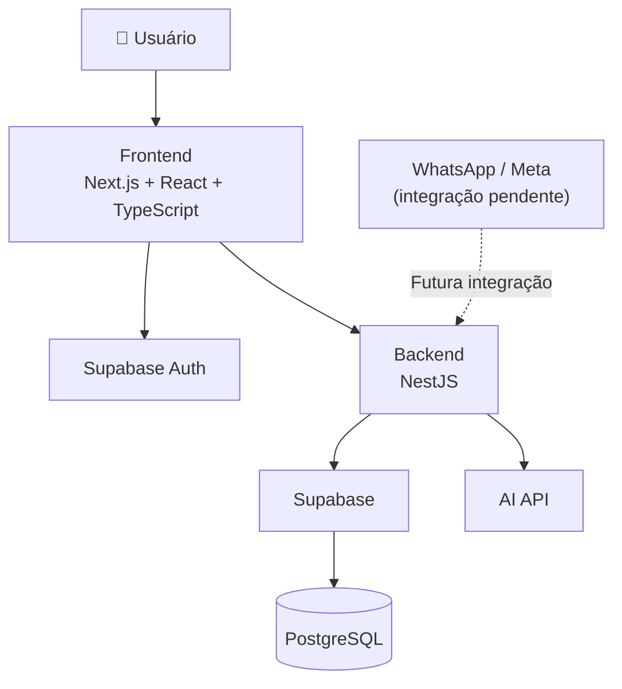
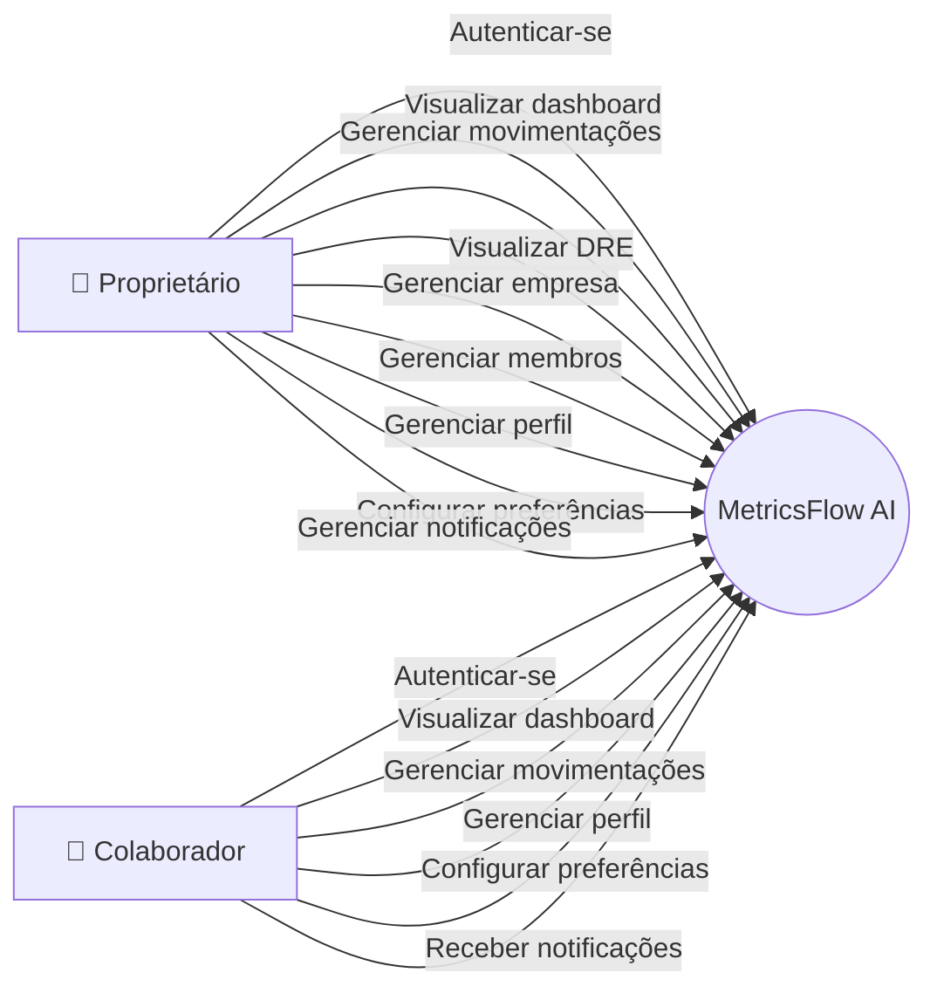
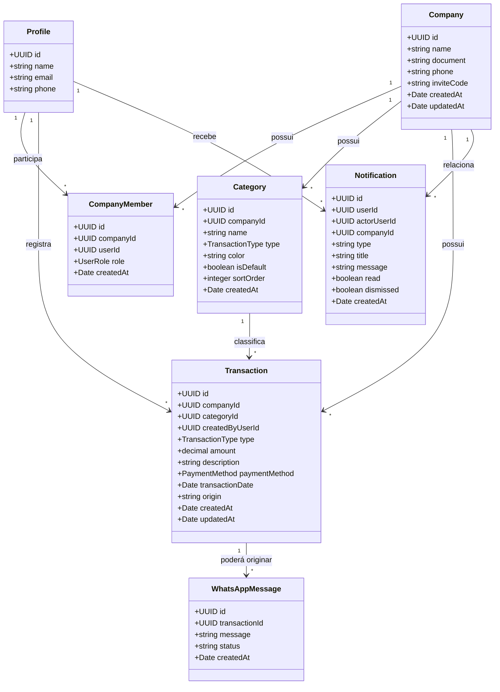
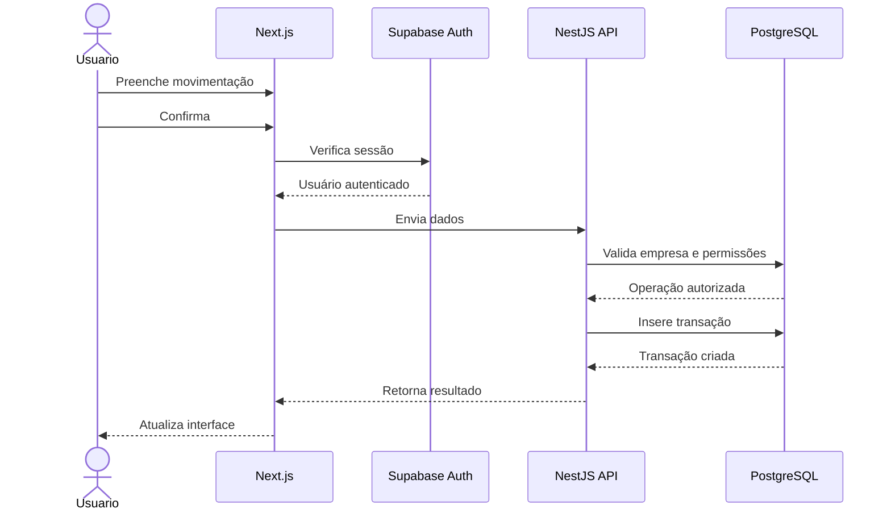
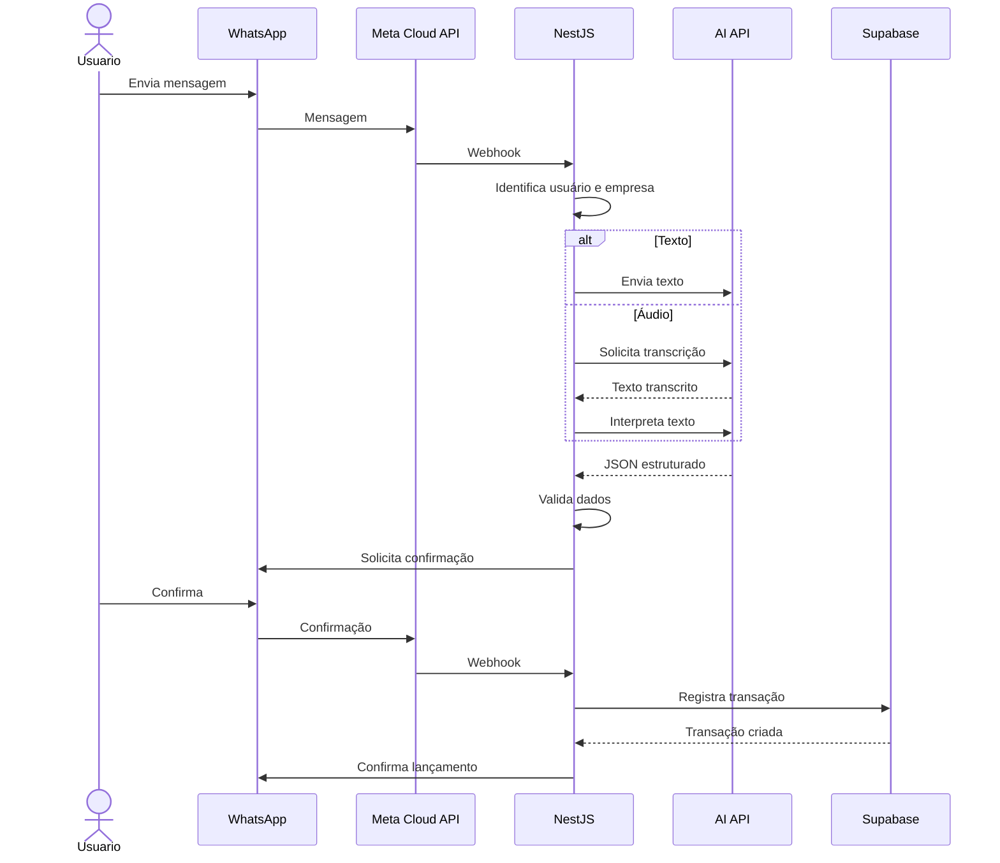
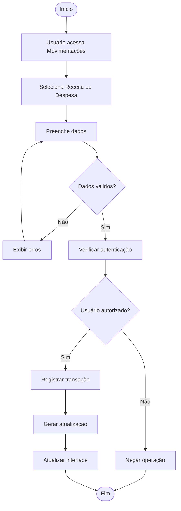
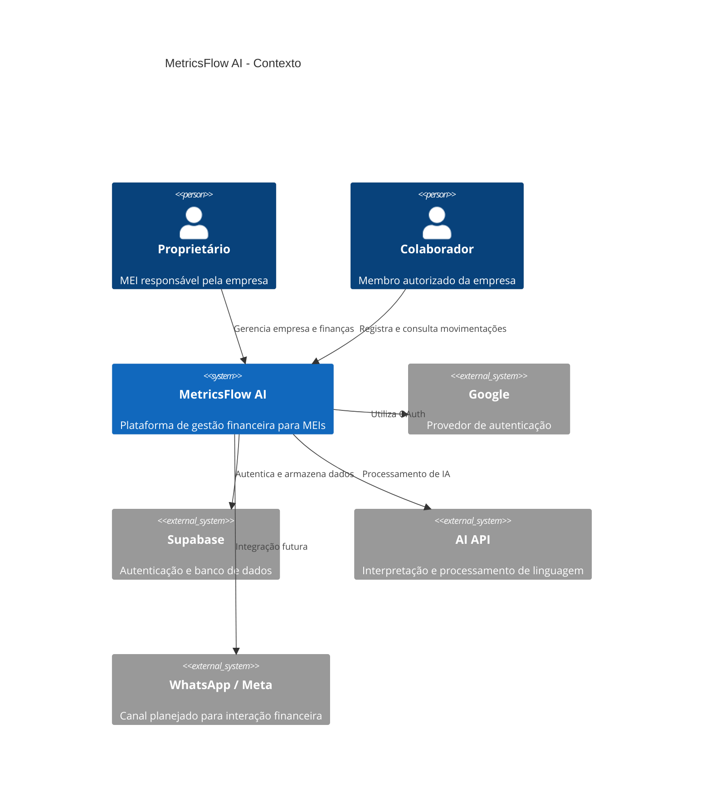
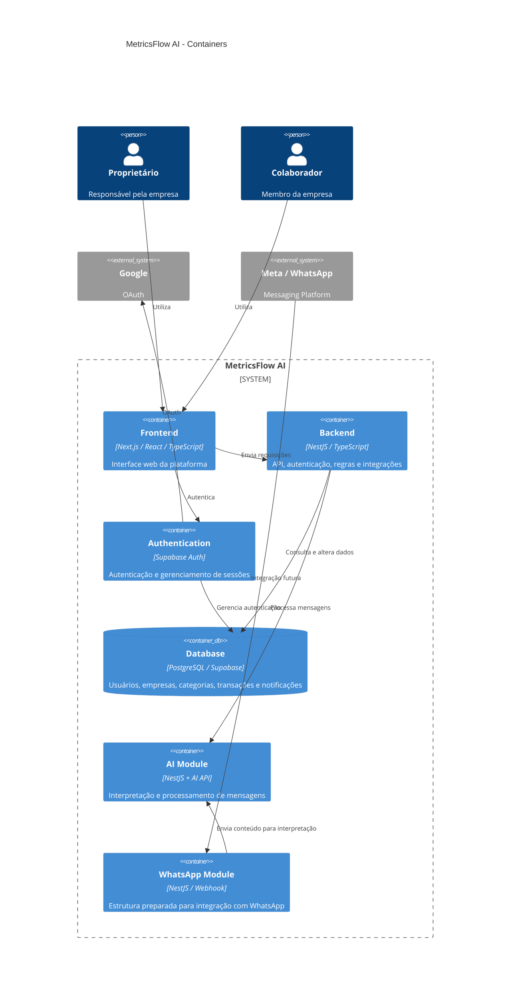

# MetricsFlow AI

> **CPM — Controle e Planejamento Financeiro para MEIs**

**Você conversa. O MetricsFlow organiza.**

O **MetricsFlow AI** é uma plataforma de gestão financeira desenvolvida para **Microempreendedores Individuais (MEIs)**, com foco em simplificar o controle das movimentações financeiras e oferecer uma visão clara da saúde financeira do negócio.

A plataforma centraliza **receitas, despesas, categorias, histórico financeiro, indicadores, DRE, empresas, usuários e preferências**, permitindo que o empreendedor acompanhe seus resultados sem depender de planilhas complexas.

A V1 estabeleceu a plataforma web de gestão financeira. A V2 evolui essa estrutura com uma arquitetura baseada em **frontend + backend**, preparando o sistema para recursos de inteligência artificial e integração com WhatsApp.

---

# Links da Documentação Acadêmica 📚

## Gerenciamento de Recursos Humanos

[🔗 Atividade Prática — Gerenciamento de RH](https://www.notion.so/Atividade-Pr-tica-Gerenciamento-de-RH-3ce2ae5e90d1803e8a62fa80af5b79b1?source=copy_link)

## Gerenciamento de Qualidade de Software

[🔗 Atividade Prática — Gerenciamento de Qualidade de Software](https://www.notion.so/Atividade-Pr-tica-Gerenciamento-de-Qualidade-de-Software-3db2ae5e90d18085ad46d38adf9928b6?source=copy_link)

## Elaboração BMC e Proposta de Valor

[🔗 Atividade Prática Elaboração BMC e Proposta de Valor](https://www.notion.so/Atividade-Pr-tica-Elabora-o-BMC-e-Proposta-de-Valor-3e32ae5e90d180d4bd04fa468ce5541f?source=copy_link)

---
## 💰 Orçamento do projeto

O orçamento e a estimativa financeira do projeto estão disponíveis no documento:

- [📄 Orçamento do projeto](docs/orcamento.pdf)

---

## 🎯 Objetivo

O objetivo do MetricsFlow AI é oferecer ao MEI uma ferramenta simples, visual e acessível para:

- Registrar receitas;
- Registrar despesas;
- Organizar movimentações por categorias;
- Consultar o histórico financeiro;
- Buscar movimentações;
- Filtrar movimentações;
- Editar transações;
- Excluir transações;
- Visualizar receitas, custos e despesas;
- Acompanhar o resultado financeiro;
- Analisar a evolução financeira através de gráficos;
- Visualizar uma DRE simplificada;
- Gerenciar informações da empresa;
- Gerenciar membros da empresa;
- Gerenciar informações pessoais;
- Configurar preferências;
- Controlar diferentes níveis de acesso;
- Receber notificações financeiras;
- Exportar informações financeiras;
- Preparar o sistema para registro financeiro através do WhatsApp;
- Preparar o sistema para interpretação de mensagens utilizando inteligência artificial.

---

# 🚀 Funcionalidades

## 📊 Dashboard

O dashboard apresenta uma visão geral da situação financeira da empresa atualmente selecionada.

Entre os principais indicadores estão:

- Faturamento;
- Receitas;
- Despesas;
- Lucro;
- Margem;
- Quantidade de movimentações;
- Evolução financeira;
- Gráficos;
- Resumo financeiro;
- Transações recentes;
- Ações rápidas.

Os dados são obtidos a partir das movimentações financeiras vinculadas à empresa.

A arquitetura também permite que os dados sejam atualizados conforme novas movimentações são registradas.

---

# 💰 Movimentações

A área de movimentações concentra o gerenciamento das entradas e saídas financeiras.

## Receitas

É possível registrar uma nova receita informando:

- Descrição;
- Valor;
- Categoria;
- Forma de pagamento;
- Data.

## Despesas

O mesmo fluxo é utilizado para registrar despesas.

## Histórico

As movimentações são apresentadas em uma tabela contendo:

- Tipo;
- Descrição;
- Categoria;
- Forma de pagamento;
- Data;
- Valor.

Também estão disponíveis:

- Busca;
- Filtro por tipo;
- Filtro por categoria;
- Filtro por período;
- Edição;
- Exclusão;
- Exportação para CSV.

As movimentações possuem uma origem, permitindo diferenciar registros realizados pela plataforma web de futuras movimentações provenientes de integrações externas.

---

# 📈 DRE

A página de **DRE — Demonstração do Resultado do Exercício** apresenta uma visão consolidada do desempenho financeiro da empresa.

A estrutura contempla:

- Receita;
- Custos;
- Despesas;
- Resultado;
- Margem;
- Distribuição por categorias;
- Comparação de indicadores;
- Gráficos;
- Seleção de período;
- Exportação dos dados para CSV.

A DRE utiliza as movimentações financeiras registradas para calcular os principais indicadores do período selecionado.

---

# 👤 Perfil

A área de perfil permite que o usuário visualize e gerencie suas informações pessoais.

Contempla:

- Nome;
- E-mail;
- Telefone;
- Informações da conta;
- Segurança.

A autenticação e a sessão do usuário são gerenciadas pelo **Supabase Auth**.

---

# 🏢 Empresa

A área de empresa concentra as informações relacionadas à organização.

Contempla:

- Dados da empresa;
- Dados cadastrais;
- Membros;
- Código de convite;
- Gerenciamento da equipe;
- Papéis de acesso.

O sistema utiliza atualmente dois papéis principais:

### Proprietário

Possui acesso administrativo à empresa e às funcionalidades restritas.

### Colaborador

Pode utilizar as funcionalidades financeiras disponibilizadas aos membros, mas possui permissões diferentes das do proprietário.

A autorização é determinada pelo vínculo existente entre o usuário e a empresa através de `company_members`.

---

# ⚙️ Preferências

A área de preferências concentra configurações relacionadas à experiência de utilização da plataforma.

Entre elas:

- Aparência;
- Notificações;
- Preferências financeiras;
- Período financeiro padrão;
- Moeda;
- Configurações relacionadas à conta;
- Área para ações sensíveis.

As preferências financeiras são persistidas no banco de dados.

---

# 🔔 Notificações

O MetricsFlow possui um sistema de notificações integrado ao banco de dados.

As notificações podem informar eventos relacionados às movimentações financeiras e ao funcionamento da plataforma.

A estrutura contempla:

- Notificações por usuário;
- Identificação da empresa;
- Identificação do usuário responsável pela ação;
- Estado de leitura;
- Estado de arquivamento;
- Data de criação;
- Preferências de recebimento.

O sistema diferencia notificações de demonstração das notificações reais do usuário autenticado.

As notificações relacionadas a movimentações respeitam as preferências configuradas pelo usuário.

---

# 🔐 Autenticação

O sistema utiliza **Supabase Auth** para autenticação e gerenciamento de sessões.

A estrutura contempla:

- Login;
- Cadastro;
- Login com Google;
- Callback de autenticação;
- Recuperação de senha;
- Redefinição de senha;
- Persistência da sessão;
- Identificação do usuário autenticado;
- Identificação da empresa vinculada;
- Controle de acesso por papel.

O vínculo entre usuário e empresa é estabelecido através da tabela:

```text
auth.users
    │
    ▼
company_members
    │
    ▼
companies
```

---

# 👥 Controle de acesso

O acesso às funcionalidades é determinado pelo papel do usuário dentro da empresa.

```text
                    Usuário autenticado
                            │
                            ▼
                    company_members
                            │
                 ┌──────────┴──────────┐
                 ▼                     ▼
              owner              collaborator
                 │                     │
                 ▼                     ▼
        Acesso administrativo    Acesso financeiro
```

## Proprietário

Possui acesso a:

- Dashboard;
- Movimentações;
- DRE;
- Perfil;
- Empresa;
- Membros;
- Preferências;
- Operações administrativas.

## Colaborador

Possui acesso a:

- Dashboard;
- Movimentações;
- Perfil;
- Preferências.

Operações administrativas e ações restritas são controladas de acordo com o papel do usuário.

---

# 🧭 Onboarding

O sistema possui um fluxo de onboarding para configuração inicial da empresa.

O processo permite:

```text
Cadastro
   ↓
Autenticação
   ↓
Onboarding
   ↓
Criação / identificação da empresa
   ↓
Vínculo do usuário
   ↓
Configuração inicial
   ↓
Categorias padrão
   ↓
Dashboard
```

A criação da empresa e o vínculo do usuário como proprietário são tratados através das regras do banco e da aplicação.

---

# 🏗️ Arquitetura do projeto

O MetricsFlow utiliza uma arquitetura **monorepo**, contendo frontend e backend no mesmo repositório Git.

```text
metricsflow-ai/
│
├── frontend/
│   └── Next.js
│
├── backend/
│   └── NestJS
│
├── .gitignore
├── README.md
└── LICENSE
```

A separação permite que frontend e backend evoluam de forma independente dentro do mesmo projeto.

---

# 🖥️ Frontend

O frontend é desenvolvido utilizando **Next.js com App Router**, React e TypeScript.

Estrutura simplificada:

```text
frontend/
│
├── src/
│   ├── app/
│   │   ├── (auth)/
│   │   ├── api/
│   │   ├── auth/
│   │   ├── dashboard/
│   │   ├── demo/
│   │   ├── dre/
│   │   ├── empresa/
│   │   ├── movimentacoes/
│   │   ├── onboarding/
│   │   ├── perfil/
│   │   ├── preferencias/
│   │   └── whatsapp/
│   │
│   ├── components/
│   ├── contexts/
│   ├── data/
│   ├── hooks/
│   ├── lib/
│   └── types/
│
├── public/
├── package.json
└── ...
```

---

# ⚙️ Backend

A V2 introduz um backend próprio desenvolvido com **NestJS**.

O backend centraliza APIs, autenticação, regras de negócio e integrações que não devem ficar expostas no frontend.

Estrutura simplificada:

```text
backend/
│
├── src/
│   ├── modules/
│   │   ├── ai/
│   │   ├── auth/
│   │   ├── categories/
│   │   ├── companies/
│   │   ├── health/
│   │   ├── supabase/
│   │   ├── transactions/
│   │   └── whatsapp/
│   │
│   ├── app.module.ts
│   └── main.ts
│
├── .env
├── package.json
└── ...
```

O backend possui prefixo global:

```text
/api
```

Principais rotas atualmente estruturadas:

```text
GET    /api
GET    /api/health
GET    /api/supabase/test

GET    /api/companies
POST   /api/companies
GET    /api/companies/:companyId/members

GET    /api/transactions
POST   /api/transactions
PATCH  /api/transactions/:id
DELETE /api/transactions/:id

GET    /api/categories

GET    /api/whatsapp/connection
POST   /api/whatsapp/connection

POST   /api/whatsapp/demo
POST   /api/whatsapp/confirm

GET    /api/whatsapp/webhook
POST   /api/whatsapp/webhook
```

A estrutura de WhatsApp está preparada no backend, mas a integração efetiva com o WhatsApp ainda não está disponível no fluxo de produção.

---

# 🧠 Inteligência Artificial

A V2 introduz uma camada de inteligência artificial preparada para interpretar mensagens financeiras.

A responsabilidade da IA é **interpretar informações**, e não executar diretamente operações no banco.

Fluxo conceitual:

```text
Mensagem
   ↓
IA
   ↓
JSON estruturado
   ↓
Validação do Backend
   ↓
Regras de negócio
   ↓
Confirmação
   ↓
Banco de dados
```

A estrutura de interpretação contempla informações como:

```json
{
  "intent": "create_transaction",
  "type": "income",
  "amount": 850,
  "description": "Projeto de criação de site",
  "categoryId": null,
  "categoryName": null,
  "paymentMethod": null,
  "transactionDate": null,
  "confidence": 0.95,
  "missingFields": []
}
```

A aplicação deve validar a resposta antes de qualquer persistência.

A IA não deve:

- Criar categorias inexistentes;
- Inventar informações;
- Registrar uma movimentação sem confirmação;
- Ignorar campos obrigatórios;
- Bypassar as regras de autorização.

---

# 📱 WhatsApp

A integração com WhatsApp é a principal funcionalidade ainda pendente da V2.

A arquitetura do backend já possui a estrutura necessária para receber e processar mensagens, porém a integração completa com a plataforma do WhatsApp ainda não está concluída.

O fluxo planejado é:

```text
                 WHATSAPP
                     │
                     ▼
              Meta Cloud API
                     │
                     ▼
                  Webhook
                     │
                     ▼
             NestJS Backend
                     │
                     ▼
             Identificação
             do usuário
                     │
                     ▼
          Identificação da empresa
                     │
                     ▼
          Processamento da mensagem
                     │
              ┌──────┴──────┐
              ▼             ▼
            Texto          Áudio
              │             │
              │       Transcrição
              │             │
              └──────┬──────┘
                     ▼
               IA / Parser
                     │
                     ▼
             Dados estruturados
                     │
                     ▼
               Validação
                     │
                     ▼
              Confirmação
                     │
              ┌──────┴──────┐
              ▼             ▼
          Confirmar       Corrigir/
              │           Cancelar
              ▼
            Supabase
              │
              ▼
          Transação
              │
              ▼
          Dashboard
```

### Regra principal

Nenhuma movimentação deverá ser registrada apenas porque a IA interpretou uma mensagem.

O fluxo previsto exige:

```text
Interpretar
    ↓
Validar
    ↓
Solicitar confirmação
    ↓
Usuário confirma
    ↓
Registrar
```

---

# 🗄️ Banco de dados

O banco de dados utiliza **Supabase / PostgreSQL**.

Principais entidades:

```text
auth.users
    │
    ├── profiles
    │
    └── company_members
             │
             ▼
          companies
             │
       ┌─────┼─────────────┐
       ▼     ▼             ▼
 categories transactions notifications
                  │
                  ▼
          whatsapp_messages
```

## Empresas

Representadas pela tabela:

```text
companies
```

Cada empresa possui suas próprias categorias, membros e movimentações.

## Membros

Representados por:

```text
company_members
```

Relacionam usuários às empresas e armazenam o papel de acesso.

## Categorias

Representadas por:

```text
categories
```

Cada categoria pertence a uma empresa e possui um tipo:

```text
income
expense
```

## Transações

Representadas por:

```text
transactions
```

Uma transação contém informações como:

- Empresa;
- Categoria;
- Usuário responsável;
- Tipo;
- Valor;
- Descrição;
- Forma de pagamento;
- Data;
- Origem;
- Data de criação;
- Data de atualização.

A origem permite identificar, por exemplo:

```text
web
whatsapp
```

A origem `whatsapp` será utilizada quando a integração estiver concluída.

## Notificações

Representadas por:

```text
notifications
```

As notificações são vinculadas ao usuário e podem também estar relacionadas a uma empresa e ao usuário responsável pela ação.

---

# 🏷️ Categorias padrão

Ao criar uma empresa, categorias padrão são disponibilizadas automaticamente.

### Receitas

- Vendas / Produtos;
- Prestação de Serviços;
- Outras Receitas.

### Despesas

- Fornecedores / Estoque;
- Aluguel / Água / Luz;
- Marketing / Anúncios;
- DAS / Impostos MEI;
- Ferramentas / Sistema;
- Outras Despesas.

A estrutura permite que cada empresa possua seu próprio conjunto de categorias.

---

# 🧠 Functions e Triggers

A camada PostgreSQL possui funções e triggers responsáveis por centralizar regras relacionadas ao sistema.

Entre as responsabilidades estão:

- Verificação de proprietário;
- Verificação de membro;
- Identificação da empresa do usuário;
- Identificação do papel do usuário;
- Criação de empresa;
- Associação do usuário como proprietário;
- Entrada em empresa através de convite;
- Criação de categorias padrão;
- Criação automática de perfil;
- Atualização automática de `updated_at`;
- Geração de notificações relacionadas a movimentações.

---

# 🔒 Segurança

A arquitetura utiliza múltiplas camadas de proteção.

São utilizados:

- Supabase Auth;
- Controle de sessão;
- Controle de membros;
- Papéis de acesso;
- Row Level Security;
- Validação de dados;
- Integridade referencial;
- Funções PostgreSQL;
- Triggers;
- Validação no backend;
- Separação de variáveis de ambiente;
- Segredos mantidos no backend.

A relação de autorização principal é:

```text
auth.uid()
    ↓
company_members
    ↓
company_id
    ↓
dados autorizados
```

Dessa forma, o usuário somente deve acessar dados das empresas às quais está vinculado.

---

# 🔐 Arquitetura de autenticação

```text
Usuário
   ↓
Next.js
   ↓
Supabase Auth
   ↓
Sessão autenticada
   ↓
Usuário
   ↓
company_members
   ↓
Empresa + Role
   ↓
Permissões
```

Quando necessário, o backend valida o token de autenticação antes de executar operações protegidas.

---

# 📐 Diagramas

## Diagrama de arquitetura



---

# 👥 Diagrama de Caso de Uso



---

# 📦 Diagrama de Classes



---

# 🔄 Diagrama de Sequência — Movimentação Web



---

# 🤖 Diagrama de Sequência — Fluxo futuro do WhatsApp

> Este fluxo representa a arquitetura planejada. A integração efetiva com o WhatsApp ainda não está concluída.



---

# ⚙️ Diagrama de Atividade

## Registro de movimentação pela plataforma



---

# 🏛️ C4 Model

## Diagrama de Contexto



---

# 📦 C4 — Containers



---

# 🧩 Organização do Backend

O backend é organizado por módulos de domínio.

```text
backend/src/modules/

├── ai/
│   ├── ai.module.ts
│   ├── parser.service.ts
│   ├── transcription.service.ts
│   └── types.ts
│
├── auth/
│
├── categories/
│
├── companies/
│
├── health/
│
├── supabase/
│
├── transactions/
│
└── whatsapp/
    ├── whatsapp.controller.ts
    ├── whatsapp.module.ts
    ├── whatsapp.service.ts
    ├── meta.service.ts
    ├── process-message.service.ts
    ├── message-guard.service.ts
    ├── types.ts
    └── dto/
```

Essa organização permite que cada domínio evolua de maneira independente.

---

# 🧩 Organização do Frontend

```text
frontend/src/

├── app/
├── components/
├── contexts/
├── data/
├── hooks/
├── lib/
└── types/
```

Os componentes são organizados de acordo com os domínios da aplicação.

Entre eles:

- Dashboard;
- Movimentações;
- DRE;
- Perfil;
- Empresa;
- Preferências;
- WhatsApp;
- Autenticação;
- Notificações;
- Formulários;
- Modais;
- Tabelas;
- Gráficos.

---

# 🧱 Stack

## Frontend

- **Next.js**
- **React**
- **TypeScript**
- **Tailwind CSS**
- **Framer Motion**
- **Lucide React**
- **Recharts**
- **React Day Picker**

## Backend

- **NestJS**
- **TypeScript**
- **REST API**
- **Class Validator**
- **Supabase**
- **OpenAI API**

## Banco e infraestrutura

- **Supabase**
- **PostgreSQL**
- **Supabase Auth**
- **Row Level Security**
- **PostgreSQL Functions**
- **PostgreSQL Triggers**

## Desenvolvimento

- **Git**
- **GitHub**
- **ESLint**
- **TypeScript**
- **npm**

## Integrações

- **Google OAuth**
- **OpenAI API**
- **Meta WhatsApp Cloud API — integração pendente**

---

# 🌐 Portas de desenvolvimento

Durante o desenvolvimento local, frontend e backend utilizam portas diferentes.

```text
Frontend Next.js
http://localhost:3002

Backend NestJS
http://localhost:3001
```

O frontend utiliza a variável:

```env
NEXT_PUBLIC_API_URL=http://localhost:3001/api
```

O backend utiliza:

```env
PORT=3001
```

---

# 🛠️ Instalação

## 1. Clone o repositório

```bash
git clone https://github.com/Rayck4dev/MetricsFlow_AI.git
```

Entre no diretório:

```bash
cd MetricsFlow_AI
```

---

# 🖥️ Configuração do Frontend

Entre na pasta:

```bash
cd frontend
```

Instale as dependências:

```bash
npm install
```

Crie:

```text
.env.local
```

Configure as variáveis necessárias do Supabase e da API.

Exemplo:

```env
NEXT_PUBLIC_API_URL=http://localhost:3001/api
```

Execute:

```bash
npm run dev -- -p 3002
```

A aplicação ficará disponível em:

```text
http://localhost:3002
```

---

# ⚙️ Configuração do Backend

Em outro terminal:

```bash
cd backend
```

Instale as dependências:

```bash
npm install
```

Crie:

```text
.env
```

Configure as variáveis necessárias para:

- Porta;
- Supabase;
- OpenAI;
- Configurações do WhatsApp;
- Segredos de integração.

Exemplo:

```env
PORT=3001
```

Execute:

```bash
npm run start:dev
```

A API ficará disponível em:

```text
http://localhost:3001
```

Health check:

```text
http://localhost:3001/api/health
```

---

# 📌 Status atual do projeto

## V1 — Plataforma Financeira

### Frontend

- [x] Landing Page
- [x] Área de demonstração
- [x] Dashboard
- [x] Cards financeiros
- [x] Gráficos
- [x] Resumo financeiro
- [x] Transações recentes
- [x] Ações rápidas
- [x] Movimentações
- [x] Cadastro de receitas
- [x] Cadastro de despesas
- [x] Edição de transações
- [x] Exclusão de transações
- [x] Busca
- [x] Filtros financeiros
- [x] Histórico
- [x] Exportação CSV
- [x] DRE
- [x] Exportação da DRE
- [x] Perfil
- [x] Empresa
- [x] Preferências
- [x] Onboarding
- [x] Login
- [x] Cadastro
- [x] Login com Google
- [x] Recuperação de senha
- [x] Redefinição de senha
- [x] Controle de acesso por papel
- [x] Sistema de notificações
- [x] Feedback visual de operações
- [x] Estrutura visual do WhatsApp

---

# 🚀 Status da V2

## Arquitetura

- [x] Estrutura monorepo
- [x] Separação `frontend/` e `backend/`
- [x] Frontend Next.js
- [x] Backend NestJS
- [x] API REST
- [x] Configuração de ambientes separados
- [x] CORS
- [x] Health check

## Backend

- [x] Estrutura NestJS
- [x] Supabase integrado
- [x] Autenticação via token
- [x] Guard de autenticação
- [x] Empresas
- [x] Membros
- [x] Categorias
- [x] Transações
- [x] CRUD de transações
- [x] Validação de permissões
- [x] Módulo de IA
- [x] Parser financeiro
- [x] Estrutura de transcrição
- [x] Estrutura inicial do módulo WhatsApp

## Inteligência Artificial

- [x] Serviço de interpretação
- [x] Estrutura de tipos financeiros
- [x] Structured Output
- [x] Identificação de intenção
- [x] Identificação de tipo
- [x] Identificação de valor
- [x] Identificação de descrição
- [x] Identificação de categoria
- [x] Identificação de forma de pagamento
- [x] Identificação de data
- [x] Validação da resposta estruturada
- [x] Preparação para transcrição de áudio

## WhatsApp

- [ ] Configuração final da integração Meta
- [ ] Webhook em ambiente público
- [ ] Recebimento real de mensagens
- [ ] Processamento real de mensagens
- [ ] Identificação do usuário através do WhatsApp
- [ ] Identificação da empresa
- [ ] Confirmação via WhatsApp
- [ ] Registro real de movimentações via WhatsApp
- [ ] Processamento de áudio em produção

> **Observação:** a integração com WhatsApp é a principal etapa ainda pendente da V2. A arquitetura e os módulos necessários já estão preparados para essa evolução.

---

# 🗺️ Roadmap

```text
                    METRICSFLOW AI
                          │
              ┌───────────┴───────────┐
              │                       │
             V1                      V2
              │                       │
     Gestão financeira        Automação + IA
              │                       │
       ┌──────┼──────┐          ┌─────┼─────┐
       │      │      │          │     │     │
      Auth   DB    Frontend     API   IA  WhatsApp
       │      │      │          │     │     │
       └──────┴──────┘          │     │     │
              │                 │     │     └── Pendente
              ▼                 ▼     ▼
         Plataforma         Backend  Parser
         financeira            │
                               ▼
                            Integração
```

---

# 🔮 Próxima etapa

A próxima etapa de desenvolvimento é concluir a integração real com o WhatsApp.

O objetivo é finalizar o fluxo:

```text
WhatsApp
    ↓
Meta Cloud API
    ↓
Webhook NestJS
    ↓
Identificação do usuário
    ↓
Identificação da empresa
    ↓
Texto / Áudio
    ↓
Interpretação
    ↓
Validação
    ↓
Confirmação
    ↓
Supabase
    ↓
Transação
    ↓
Dashboard
```

A integração deverá respeitar as regras de segurança e confirmação antes de qualquer lançamento financeiro.

---

# 🧠 Visão do produto

O MetricsFlow AI pretende evoluir de uma plataforma de controle financeiro para um **assistente de gestão financeira voltado para MEIs**.

A evolução do produto ocorre em duas etapas:

### V1

A plataforma web estabelece a base de gestão:

```text
Autenticação
      ↓
Empresa
      ↓
Categorias
      ↓
Movimentações
      ↓
Dashboard
      ↓
DRE
```

### V2

A plataforma evolui para uma experiência conversacional:

```text
WhatsApp
    ↓
Mensagem
    ↓
IA
    ↓
Confirmação
    ↓
Movimentação
    ↓
Dashboard
```

A proposta é tornar o controle financeiro mais simples para empreendedores que precisam administrar o próprio negócio sem depender de planilhas ou processos complexos.

---

# 👩‍💻 Desenvolvimento individual

O MetricsFlow AI é desenvolvido individualmente.

Dessa forma, as responsabilidades necessárias para a construção do produto são acumuladas pela mesma desenvolvedora.

| Área             | Responsabilidades                                            |
| ---------------- | ------------------------------------------------------------ |
| Gestão / Produto | Requisitos, funcionalidades, planejamento e priorização      |
| UI/UX            | Identidade visual, experiência, responsividade e componentes |
| Frontend         | Next.js, React, TypeScript, componentes e integração         |
| Backend          | NestJS, APIs, regras de negócio e integrações                |
| Banco de Dados   | PostgreSQL, Supabase, RLS, Functions e Triggers              |
| IA               | Integração, prompts, interpretação e Structured Output       |
| QA / Testes      | Testes funcionais, validação e correção de bugs              |
| DevOps           | Git, ambientes, build, deploy e variáveis                    |
| Documentação     | README, diagramas e documentação técnica                     |

---

# 📂 Estrutura geral do projeto

```text
metricsflow-ai/
│
├── frontend/
│   ├── public/
│   ├── src/
│   │   ├── app/
│   │   ├── components/
│   │   ├── contexts/
│   │   ├── data/
│   │   ├── hooks/
│   │   ├── lib/
│   │   └── types/
│   ├── .env.local
│   ├── package.json
│   └── ...
│
├── backend/
│   ├── src/
│   │   ├── modules/
│   │   │   ├── ai/
│   │   │   ├── auth/
│   │   │   ├── categories/
│   │   │   ├── companies/
│   │   │   ├── health/
│   │   │   ├── supabase/
│   │   │   ├── transactions/
│   │   │   └── whatsapp/
│   │   ├── app.module.ts
│   │   └── main.ts
│   ├── .env
│   ├── package.json
│   └── ...
│
├── README.md
├── LICENSE
└── .gitignore
```

---

# 📄 Licença

Este projeto está licenciado sob a **MIT License**.

Consulte o arquivo [`LICENSE`](./LICENSE) para obter os termos completos da licença.

---

# 🎯 MetricsFlow AI

**Você conversa. O MetricsFlow organiza.**

Projeto desenvolvido como solução de **Controle e Planejamento Financeiro (CPM) para MEIs**.

### V1

Plataforma web completa de gestão financeira.

### V2

Evolução da plataforma para uma arquitetura com **frontend, backend e inteligência artificial**, preparando o registro financeiro conversacional através do WhatsApp.

**Status atual:** plataforma financeira funcional, backend estruturado e integração com WhatsApp em desenvolvimento.
