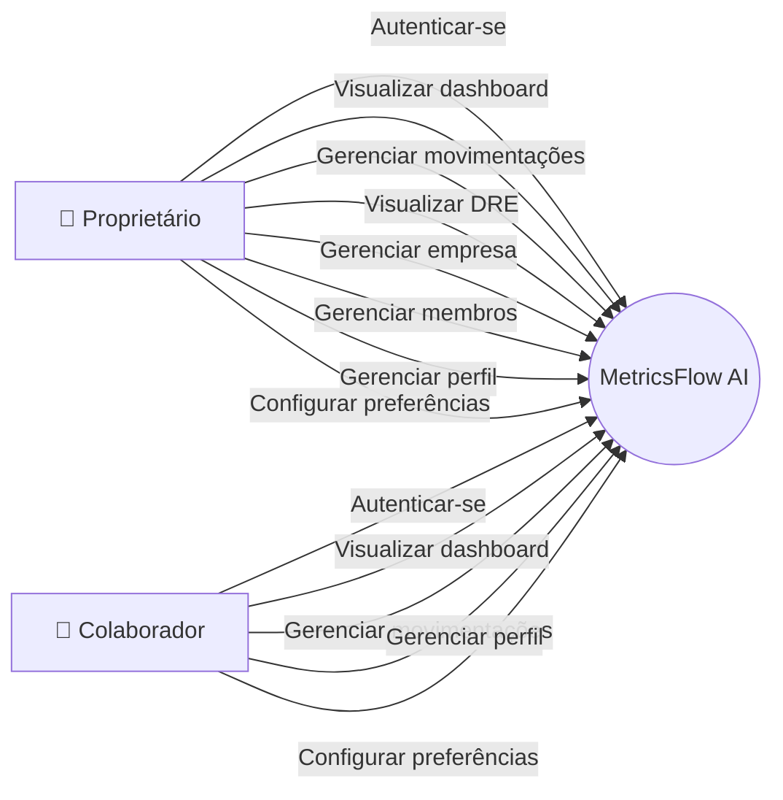
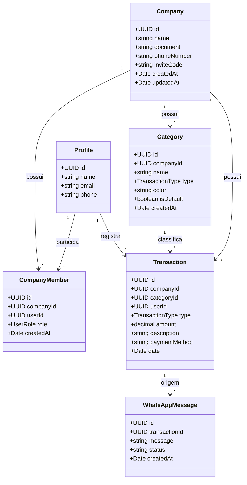
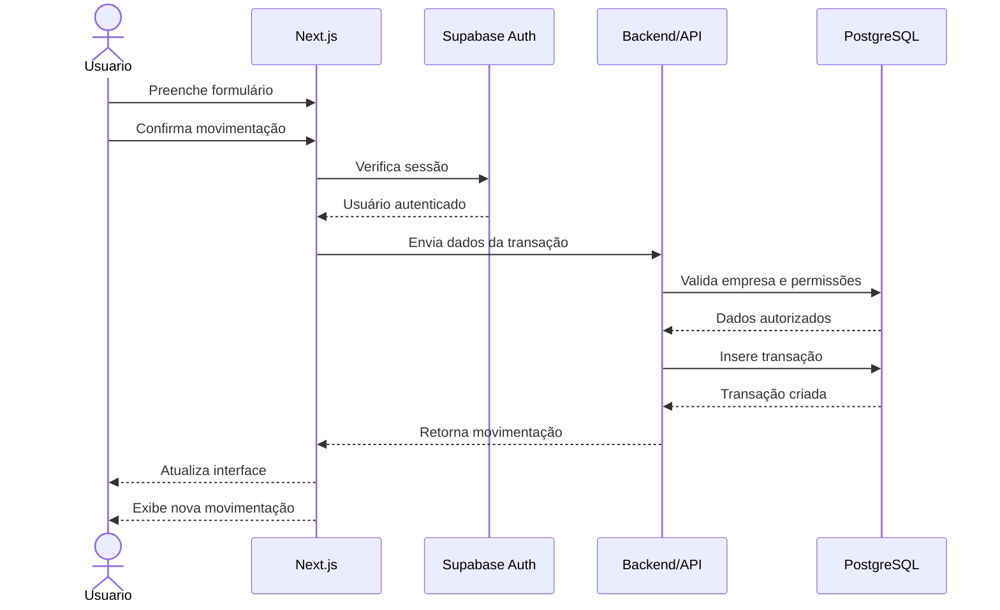
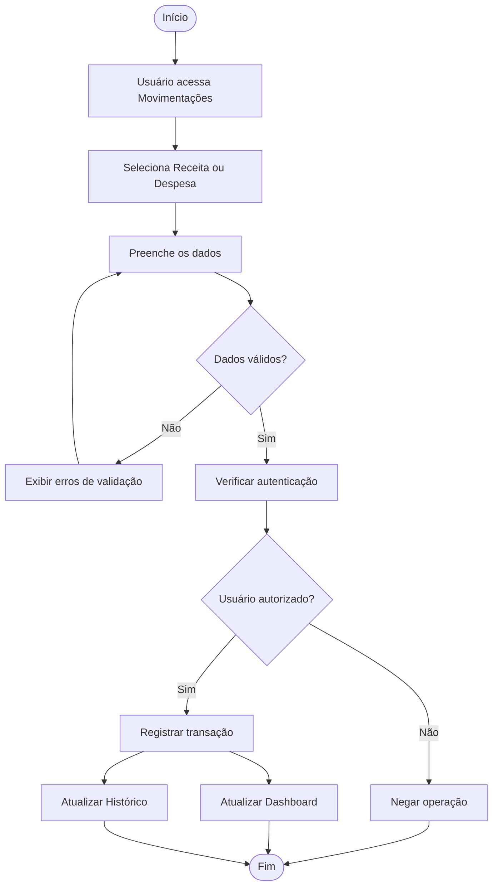
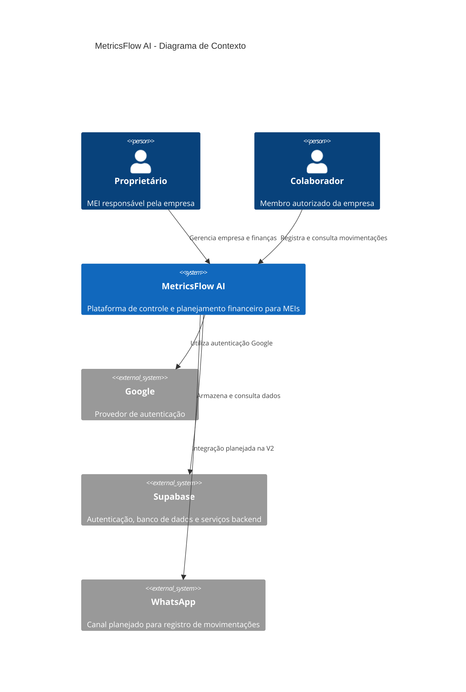
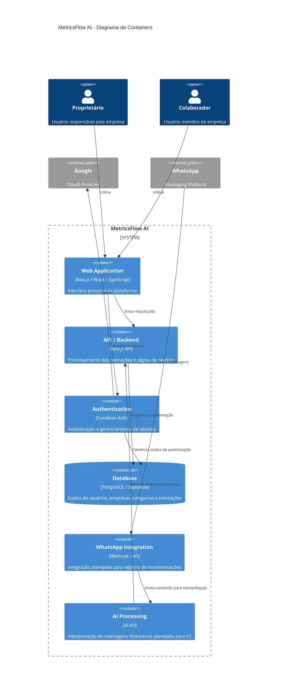

# MetricsFlow AI

> **CPM — Controle e Planejamento Financeiro para MEIs**

O **MetricsFlow AI** é uma plataforma web de gestão financeira desenvolvida para **Microempreendedores Individuais (MEIs)**, com o objetivo de simplificar o controle financeiro e proporcionar uma visão clara da saúde financeira do negócio.

A plataforma centraliza **receitas, despesas, categorias, histórico financeiro, indicadores e DRE**, permitindo que o empreendedor acompanhe seus resultados sem depender de planilhas complexas.

A V1 do projeto foi desenvolvida com foco na construção da plataforma, autenticação, gerenciamento de empresas, controle de usuários, movimentações financeiras e visualização dos indicadores.

A arquitetura também foi preparada para futuras evoluções envolvendo **WhatsApp e inteligência artificial**, previstas para a V2.

---

# 🎯 Objetivo

O objetivo do MetricsFlow AI é oferecer ao MEI uma ferramenta simples, visual e acessível para:

- Registrar receitas;
- Registrar despesas;
- Organizar movimentações por categorias;
- Consultar o histórico financeiro;
- Filtrar movimentações;
- Editar transações;
- Excluir transações;
- Visualizar receitas;
- Visualizar custos e despesas;
- Acompanhar o resultado financeiro;
- Analisar a evolução financeira através de gráficos;
- Visualizar uma DRE simplificada;
- Gerenciar informações da empresa;
- Gerenciar informações pessoais;
- Configurar preferências da plataforma;
- Controlar diferentes níveis de acesso;
- Preparar a plataforma para futuras integrações com WhatsApp e IA.

---

# 🚀 Funcionalidades

## 📊 Dashboard

O dashboard apresenta uma visão geral da situação financeira da empresa.

Entre os principais indicadores estão:

- Faturamento;
- Receitas;
- Despesas;
- Lucro;
- Margem;
- Quantidade de movimentações;
- Evolução financeira;
- Gráficos;
- Resumo das movimentações;
- Transações recentes;
- Ações rápidas.

Os dados do dashboard são organizados considerando a empresa atualmente selecionada pelo usuário.

---

# 💰 Movimentações

A área de movimentações concentra o gerenciamento das entradas e saídas financeiras.

## Receitas

É possível registrar uma nova receita informando:

- Descrição;
- Valor;
- Categoria;
- Forma de pagamento;
- Data.

## Despesas

O mesmo fluxo é utilizado para registrar despesas.

## Histórico

As movimentações são apresentadas em uma tabela contendo informações como:

- Tipo;
- Descrição;
- Categoria;
- Forma de pagamento;
- Data;
- Valor.

Também são disponibilizados recursos de:

- Busca;
- Filtro por tipo;
- Filtro por categoria;
- Filtro por período;
- Edição;
- Exclusão.

---

# 📈 DRE

A página de **DRE — Demonstração do Resultado do Exercício** apresenta uma visão consolidada do desempenho financeiro da empresa.

A estrutura contempla:

- Receita;
- Custos;
- Despesas;
- Resultado;
- Distribuição por categorias;
- Comparação de indicadores;
- Gráficos;
- Seleção de período.

A DRE foi estruturada de maneira desacoplada para permitir que os dados apresentados possam evoluir juntamente com a integração do backend.

---

# 👤 Perfil

A área de perfil permite que o usuário visualize e gerencie suas informações pessoais.

Atualmente contempla:

- Nome;
- E-mail;
- Telefone;
- Informações relacionadas à conta;
- Segurança.

A autenticação dos usuários é realizada através do sistema de autenticação do Supabase.

---

# 🏢 Empresa

A área de empresa concentra as informações relacionadas à organização.

A estrutura contempla:

- Dados da empresa;
- Dados cadastrais;
- Membros;
- Código de convite;
- Gerenciamento da equipe;
- Papéis de acesso.

O sistema trabalha atualmente com dois papéis principais:

### Proprietário

Possui acesso administrativo à empresa e às funcionalidades restritas.

### Colaborador

Pode utilizar as funcionalidades financeiras liberadas para membros da empresa, mas não possui os mesmos privilégios administrativos do proprietário.

---

# ⚙️ Preferências

A área de preferências concentra configurações relacionadas à experiência de utilização da plataforma.

Entre elas:

- Aparência;
- Notificações;
- Preferências financeiras;
- Configurações relacionadas à conta;
- Área para ações sensíveis.

---

# 🔐 Autenticação

O sistema utiliza autenticação através do **Supabase Auth**.

A estrutura atual contempla:

- Login;
- Cadastro;
- Login com Google;
- Callback de autenticação;
- Recuperação de senha;
- Redefinição de senha;
- Persistência da sessão;
- Controle do usuário autenticado.

O sistema também identifica automaticamente o vínculo entre o usuário autenticado e sua empresa através da tabela `company_members`.

---

# 👥 Controle de acesso

O acesso às funcionalidades é determinado pelo papel do usuário dentro da empresa.

Os papéis atualmente utilizados são:

```text
owner
  │
  ├── Acesso ao Dashboard
  ├── Acesso às Movimentações
  ├── Acesso à DRE
  ├── Acesso ao Perfil
  ├── Acesso à Empresa
  └── Acesso às Preferências

collaborator
  │
  ├── Acesso ao Dashboard
  ├── Acesso às Movimentações
  ├── Acesso ao Perfil
  └── Acesso às Preferências
```

A estrutura permite que novas regras de permissão sejam adicionadas futuramente.

---

# 📱 WhatsApp

A integração com WhatsApp faz parte da evolução planejada para a **V2**.

A proposta é permitir que o MEI possa registrar movimentações financeiras através de mensagens.

O fluxo planejado é:

```text
Usuário
   ↓
WhatsApp
   ↓
Webhook
   ↓
Backend
   ↓
Inteligência Artificial
   ↓
Interpretação da mensagem
   ↓
JSON estruturado
   ↓
Supabase
   ↓
Movimentação financeira
   ↓
Dashboard
```

A funcionalidade ainda não faz parte do fluxo financeiro principal da V1.

---

# 🤖 Inteligência Artificial

A utilização de inteligência artificial está planejada para a segunda fase do projeto.

A IA deverá interpretar mensagens enviadas pelo usuário e identificar informações financeiras.

Exemplo:

```text
Usuário:

"Recebi 850 reais de um projeto de criação de site hoje"
```

A IA deverá transformar a mensagem em informações estruturadas semelhantes a:

```json
{
  "type": "income",
  "amount": 850,
  "description": "Projeto de criação de site",
  "category": "Serviços",
  "date": "2026-08-28"
}
```

A partir dessas informações, o backend poderá validar os dados e registrar a movimentação no banco.

A proposta da V2 é utilizar APIs de inteligência artificial existentes, sem necessidade de treinamento de um modelo próprio.

---

# 🏗️ Arquitetura do projeto

O projeto utiliza **Next.js com App Router**, organizando as páginas, componentes e recursos por domínio funcional.

Estrutura atual simplificada:

```text
metricsflow-ai/
│
├── .next/
├── node_modules/
├── public/
│
├── src/
│   │
│   ├── app/
│   │   ├── (auth)/
│   │   ├── api/
│   │   ├── auth/
│   │   │   └── callback/
│   │   ├── dashboard/
│   │   ├── demo/
│   │   ├── dre/
│   │   ├── empresa/
│   │   ├── movimentacoes/
│   │   ├── onboarding/
│   │   ├── perfil/
│   │   ├── preferencias/
│   │   ├── recuperar-senha/
│   │   ├── redefinir-senha/
│   │   ├── whatsapp/
│   │   ├── favicon.ico
│   │   ├── globals.css
│   │   ├── layout.tsx
│   │   └── page.tsx
│   │
│   ├── components/
│   │
│   ├── contexts/
│   │
│   ├── data/
│   │
│   ├── hooks/
│   │
│   ├── lib/
│   │
│   ├── types/
│   │
│   └── tests/
│
├── .env.local
├── .gitignore
├── AGENTS.md
├── CLAUDE.md
├── eslint.config.mjs
├── LICENSE
├── next-env.d.ts
├── next.config.ts
├── package.json
├── postcss.config.mjs
├── README.md
├── tailwind.config.ts
└── tsconfig.json
```

---

# 🧩 Organização da aplicação

## `src/app`

Contém as páginas e rotas da aplicação utilizando o App Router do Next.js.

Principais áreas:

```text
app/
├── dashboard/
├── demo/
├── dre/
├── empresa/
├── movimentacoes/
├── onboarding/
├── perfil/
├── preferencias/
└── whatsapp/
```

---

## `src/components`

Contém componentes reutilizáveis da interface.

A separação por componentes permite que elementos como cards, tabelas, formulários, gráficos, modais e elementos de navegação sejam reutilizados em diferentes páginas.

---

## `src/contexts`

Contém os contextos globais da aplicação.

Um dos principais contextos é responsável pelos dados do usuário autenticado e pelo vínculo do usuário com a empresa.

Exemplo conceitual:

```text
Auth
 ↓
Usuário
 ↓
Empresa
 ↓
Role
 ↓
Permissões
```

---

## `src/data`

Contém dados estáticos e estruturas utilizadas principalmente para desenvolvimento e apresentação da aplicação.

---

## `src/hooks`

Contém hooks personalizados utilizados para encapsular comportamentos reutilizáveis.

---

## `src/lib`

Contém funções auxiliares, configurações e integrações utilizadas pela aplicação.

Entre elas está a configuração do cliente Supabase.

---

## `src/types`

Contém tipos TypeScript compartilhados entre diferentes partes da aplicação.

---

## `src/tests`

Contém os testes automatizados e estruturas relacionadas à validação da aplicação.

A pasta será utilizada para validar principalmente:

- Autenticação;
- Permissões;
- Movimentações;
- Regras de negócio;
- Componentes;
- Fluxos principais.

---

# 🗄️ Banco de dados

O banco de dados utiliza **Supabase / PostgreSQL**.

A estrutura principal é baseada nas seguintes entidades:

```text
profiles
    │
    │
    ▼
company_members
    │
    ▼
companies
    │
    ├──────────────┐
    ▼              ▼
categories     transactions
                    │
                    ▼
             whatsapp_messages
```

---

# 🏢 Empresas

A tabela `companies` representa as empresas cadastradas na plataforma.

Principais informações:

- ID;
- Nome;
- Documento;
- Telefone;
- Código de convite;
- Data de criação;
- Data de atualização.

Cada empresa possui suas próprias categorias e movimentações.

---

# 👥 Membros

A tabela `company_members` relaciona usuários às empresas.

Cada membro possui um papel:

```text
owner
collaborator
```

A relação utiliza:

```text
company_id
user_id
role
```

Também existe uma restrição para evitar múltiplos proprietários vinculados ao mesmo usuário.

---

# 🗂️ Categorias

As categorias são relacionadas diretamente à empresa.

Cada categoria possui:

- ID;
- Empresa;
- Nome;
- Tipo;
- Cor;
- Indicador de categoria padrão;
- Data de criação.

O tipo da categoria diferencia:

```text
income
expense
```

A estrutura permite que cada empresa tenha seu próprio conjunto de categorias.

---

# 💸 Transações

As transações representam as movimentações financeiras realizadas pela empresa.

Uma transação possui informações como:

- Tipo;
- Valor;
- Descrição;
- Categoria;
- Forma de pagamento;
- Data;
- Empresa;
- Usuário responsável pelo registro.

As transações são utilizadas pelo:

- Dashboard;
- Histórico;
- DRE;
- Gráficos;
- Indicadores financeiros.

---

# 🔒 Segurança

A arquitetura do projeto considera o isolamento dos dados por empresa.

São utilizados conceitos como:

- Autenticação;
- Controle de membros;
- Papéis de acesso;
- Isolamento por empresa;
- Row Level Security (RLS);
- Validação de dados;
- Integridade referencial;
- Controle das operações financeiras.

A aplicação utiliza o usuário autenticado para identificar a empresa e as permissões correspondentes.

---

# 📐 UML

A modelagem da aplicação utiliza diagramas UML para representar os principais comportamentos e estruturas do sistema.

---

## Diagrama de Caso de Uso

O diagrama apresenta as principais interações entre os usuários e o MetricsFlow AI.



---

# 📦 Diagrama de Classes

O diagrama representa as principais entidades relacionadas ao domínio financeiro.



---

# 🔄 Diagrama de Sequência

O fluxo abaixo representa o registro de uma movimentação financeira.



---

# ⚙️ Diagrama de Atividade

O fluxo representa o processo de cadastro de uma movimentação.



---

# 🏛️ C4 Model

A arquitetura também pode ser representada utilizando o **C4 Model**, através dos diagramas de contexto e container.

---

## Diagrama de Contexto — C4

O diagrama de contexto apresenta o MetricsFlow AI e os principais atores e sistemas externos.



---

## Diagrama de Containers — C4

O diagrama de containers apresenta os principais componentes tecnológicos da plataforma.



---

# 🧱 Stack

## Frontend

- **Next.js**
- **React**
- **TypeScript**
- **Tailwind CSS**
- **Framer Motion**
- **Lucide React**
- **Recharts**

## Backend / Infraestrutura

- **Supabase**
- **PostgreSQL**
- **Supabase Auth**
- **Row Level Security (RLS)**

## Desenvolvimento

- **ESLint**
- **TypeScript**
- **Git / GitHub**

## Futuras integrações

- WhatsApp API;
- Webhooks;
- API de Inteligência Artificial;
- Processamento de mensagens.

---

# 🛠️ Instalação

Clone o repositório:

```bash
git clone https://github.com/Rayck4dev/MetricsFlow_AI
```

Entre no diretório:

```bash
cd metricsflow-ai
```

Instale as dependências:

```bash
npm install
```

Crie o arquivo de variáveis de ambiente:

```text
.env.local
```

Configure as variáveis necessárias do Supabase.

Execute o projeto em desenvolvimento:

```bash
npm run dev
```

A aplicação ficará disponível no endereço informado pelo Next.js, normalmente:

```text
http://localhost:3000
```

---

# 🧪 Testes

A pasta de testes está localizada em:

```text
src/tests/
```

Os testes têm como objetivo validar os principais fluxos da aplicação e reduzir regressões durante a evolução do projeto.

As áreas prioritárias de testes são:

### Autenticação

- Login;
- Cadastro;
- Login com Google;
- Logout;
- Recuperação de senha;
- Redefinição de senha;
- Persistência da sessão.

### Usuários

- Carregamento do perfil;
- Identificação da empresa;
- Identificação do papel do usuário;
- Proprietário;
- Colaborador.

### Empresas

- Criação;
- Associação de membros;
- Código de convite;
- Permissões administrativas.

### Movimentações

- Criar receita;
- Criar despesa;
- Editar transação;
- Excluir transação;
- Filtrar transações;
- Validar valores;
- Validar categorias.

### Dashboard

- Cálculo de receitas;
- Cálculo de despesas;
- Cálculo de lucro;
- Cálculo de margem;
- Atualização dos indicadores.

### DRE

- Receita;
- Custos;
- Despesas;
- Resultado;
- Seleção de período.

---

# 📌 Status da V1

## Frontend

- [x] Dashboard
- [x] Header
- [x] Cards financeiros
- [x] Gráficos
- [x] Resumo financeiro
- [x] Transações recentes
- [x] Ações rápidas
- [x] Movimentações
- [x] Cadastro de receitas
- [x] Cadastro de despesas
- [x] Edição de transações
- [x] Exclusão de transações
- [x] Filtros financeiros
- [x] Histórico de movimentações
- [x] DRE
- [x] Perfil
- [x] Empresa
- [x] Preferências
- [x] Onboarding
- [x] Login
- [x] Cadastro
- [x] Login com Google
- [x] Recuperação de senha
- [x] Redefinição de senha
- [x] Controle de acesso por papel
- [x] Área de demonstração
- [x] Estrutura inicial do WhatsApp

---

# 🗄️ Status do Backend

- [x] Supabase configurado
- [x] PostgreSQL
- [x] Autenticação
- [x] Perfis
- [x] Empresas
- [x] Membros
- [x] Papéis de acesso
- [x] Categorias
- [x] Transações
- [x] Relacionamentos
- [x] Políticas de segurança
- [x] Integração frontend + banco

---

# 🚀 Roadmap

## V1 — Plataforma Financeira

```text
Planejamento
     ↓
Design
     ↓
Arquitetura
     ↓
Frontend
     ↓
Autenticação
     ↓
Banco de Dados
     ↓
Integração Supabase
     ↓
Dashboard
     ↓
Movimentações
     ↓
DRE
     ↓
Controle de acesso
     ↓
Testes
     ↓
Entrega
```

---

# 🤖 V2 — Inteligência e Automação

A segunda fase do projeto tem como objetivo transformar o MetricsFlow AI em um assistente financeiro mais automatizado.

### WhatsApp

- [ ] Configurar API/WhatsApp
- [ ] Configurar webhook
- [ ] Receber mensagens
- [ ] Processar mensagens
- [ ] Identificar usuário
- [ ] Identificar empresa
- [ ] Registrar histórico das mensagens

### Inteligência Artificial

- [ ] Integrar API de IA
- [ ] Criar prompt estruturado
- [ ] Utilizar Structured Outputs / JSON
- [ ] Identificar tipo da movimentação
- [ ] Identificar valor
- [ ] Identificar descrição
- [ ] Identificar categoria
- [ ] Identificar data
- [ ] Validar informações recebidas

### Backend

- [ ] Criar rota para processamento
- [ ] Validar resposta da IA
- [ ] Executar inserção no Supabase
- [ ] Retornar confirmação
- [ ] Criar tratamento de erros
- [ ] Criar logs

### Dashboard

- [ ] Atualização após lançamento via WhatsApp
- [ ] Histórico de lançamentos automatizados
- [ ] Identificação da origem da movimentação
- [ ] Indicadores de automação

---

# 🧠 Visão futura

O MetricsFlow AI pretende evoluir de uma plataforma de controle financeiro para um **assistente de gestão financeira voltado para MEIs**.

A evolução planejada inclui:

- Registro financeiro via WhatsApp;
- Automação de lançamentos;
- Interpretação de mensagens;
- Análise financeira inteligente;
- Alertas;
- Insights sobre receitas e despesas;
- Auxílio na interpretação da DRE;
- Recomendações baseadas no comportamento financeiro.

A proposta é reduzir a complexidade da gestão financeira para empreendedores que precisam administrar o próprio negócio sem necessariamente possuir conhecimentos avançados de contabilidade ou gestão financeira.

---

# 👤 Matriz de papéis acumulados

O MetricsFlow AI é desenvolvido individualmente. Dessa forma, todas as áreas necessárias para o desenvolvimento do projeto são acumuladas pela mesma desenvolvedora.

| Papel                | Responsabilidades                                                                                          |
| -------------------- | ---------------------------------------------------------------------------------------------------------- |
| **Gestão / Produto** | Levantamento de requisitos, definição de funcionalidades, organização das tarefas e priorização do projeto |
| **UI/UX**            | Arquitetura visual, experiência de navegação, identidade visual, responsividade e componentes              |
| **Frontend**         | Desenvolvimento das páginas, componentização, estados, interações, validações e integração com dados       |
| **Backend**          | Desenvolvimento futuro das APIs, regras de negócio, autenticação e integrações                             |
| **Banco de Dados**   | Modelagem, relacionamentos, políticas de acesso, integridade e manutenção do banco                         |
| **QA / Testes**      | Testes funcionais, validação dos fluxos, identificação e correção de bugs                                  |
| **Documentação**     | README, documentação técnica, organização do projeto e registro das decisões                               |
| **DevOps / Deploy**  | Configuração do ambiente, versionamento, build, deploy e infraestrutura                                    |

### Desenvolvimento individual

Por se tratar de um projeto desenvolvido individualmente, as diferentes responsabilidades são acumuladas ao longo das etapas do projeto.

Essa abordagem permite que todas as decisões de **produto, design, desenvolvimento, banco de dados, testes e documentação** sejam centralizadas durante a construção do MetricsFlow AI.

---

# 📋 Papéis considerados

## Gestão / Produto

- Levantamento de requisitos;
- Organização das tarefas;
- Definição de funcionalidades;
- Priorização;
- Planejamento das versões.

## UI/UX

- Estrutura visual;
- Experiência de navegação;
- Componentes;
- Responsividade;
- Identidade visual.

## Frontend

- Desenvolvimento das páginas;
- Componentização;
- Integração com dados;
- Estados;
- Interações;
- Validações.

## Backend

- APIs;
- Regras de negócio;
- Autenticação;
- Integrações;
- Segurança.

## Banco de Dados

- Modelagem;
- Relacionamentos;
- Índices;
- Políticas de acesso;
- Integridade dos dados.

## QA / Testes

- Testes funcionais;
- Identificação de bugs;
- Validação de fluxos;
- Testes de integração;
- Regressão.

## Documentação

- README;
- Documentação técnica;
- Diagramas;
- Organização do projeto;
- Registro das decisões.

---

# 🗺️ Roadmap geral

```text
                         METRICSFLOW AI
                               │
              ┌────────────────┴────────────────┐
              │                                 │
             V1                                V2
              │                                 │
      Gestão financeira                 Automação + IA
              │                                 │
      ├── Autenticação                   ├── WhatsApp
      ├── Empresas                       ├── Webhook
      ├── Membros                        ├── IA
      ├── Categorias                     ├── Structured Output
      ├── Transações                     ├── Processamento
      ├── Dashboard                      ├── Automação
      ├── DRE                            └── Insights
      └── Segurança
```

---

# 📄 Licença

Este projeto está licenciado sob a **MIT License**.

Consulte o arquivo [`LICENSE`](./LICENSE) para obter os termos completos da licença.

---

# 🎯 MetricsFlow AI

**Controle. Analise. Cresça.**

Projeto desenvolvido como solução de **Controle e Planejamento Financeiro (CPM) para MEIs**.

---

A V1 concentra a estrutura principal de gestão financeira da plataforma.

A V2 terá como foco a **automação através de WhatsApp e Inteligência Artificial**.
