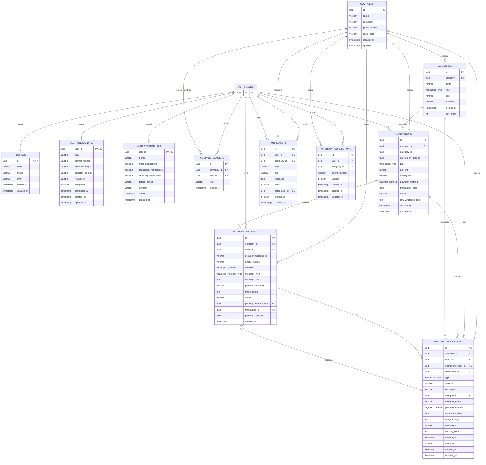

# 🗄️ Modelagem do Banco de Dados

## 🗄️ Modelagem do Banco de Dados

O banco de dados do **MetricsFlow AI** utiliza **PostgreSQL através do Supabase**.

A modelagem é organizada em torno das principais entidades do sistema, incluindo usuários, perfis, empresas, membros, categorias, transações e os recursos relacionados à integração com WhatsApp.

A autenticação dos usuários é realizada pelo **Supabase Auth**, cuja tabela `auth.users` é utilizada como referência para os dados relacionados aos usuários da aplicação.

### Diagrama Entidade-Relacionamento


      
### Principais entidades

#### `auth.users`

Tabela gerenciada pelo **Supabase Auth**, responsável pelo armazenamento dos usuários autenticados da plataforma.

A chave `id` identifica o usuário no sistema e é utilizada como referência nas demais tabelas relacionadas à autenticação.

---

#### `profiles`

Armazena os dados complementares do usuário.

Principais informações:

* Nome;
* E-mail;
* Telefone;
* Data de criação;
* Data de atualização.

A chave primária `id` também funciona como chave estrangeira para `auth.users`.

---

#### `user_onboarding`

Armazena as informações coletadas durante o processo inicial de configuração do usuário.

Entre os dados registrados estão:

* Objetivo;
* Método de controle financeiro;
* Principal desafio;
* Métricas selecionadas;
* Frequência;
* Status de conclusão.

A entidade é vinculada diretamente ao usuário autenticado.

---

#### `user_preferences`

Armazena as preferências individuais do usuário.

Entre elas estão:

* Tema;
* Notificações por e-mail;
* Notificações de movimentações;
* Notificações do WhatsApp;
* Período financeiro padrão;
* Moeda.

Essas informações permitem personalizar o comportamento da aplicação para cada usuário.

---

#### `companies`

Representa as empresas cadastradas no MetricsFlow AI.

Principais informações:

* Nome;
* Documento;
* Telefone;
* Código de convite;
* Data de criação;
* Data de atualização.

Uma empresa pode possuir diversos membros, categorias, transações, notificações e dados relacionados ao WhatsApp.

---

#### `company_members`

É a entidade responsável pelo relacionamento entre usuários e empresas.

Ela permite que diferentes usuários participem de uma mesma empresa e define o papel de cada membro.

Os principais papéis utilizados pelo sistema são:

* `owner`;
* `collaborator`.

Esse relacionamento também é utilizado no controle de permissões da aplicação.

---

#### `categories`

Representa as categorias financeiras utilizadas para classificar as movimentações.

Cada categoria pertence a uma empresa e possui um tipo:

* Receita;
* Despesa.

Também são armazenadas informações como:

* Nome;
* Cor;
* Identificação de categoria padrão;
* Ordem de exibição.

---

#### `transactions`

Representa as movimentações financeiras registradas no sistema.

Cada movimentação possui informações como:

* Empresa;
* Categoria;
* Usuário responsável pelo registro;
* Tipo;
* Valor;
* Descrição;
* Forma de pagamento;
* Data da movimentação;
* Origem;
* Texto original do WhatsApp, quando aplicável.

A origem permite identificar se a movimentação foi criada pela aplicação web ou por uma integração externa, como o WhatsApp.

---

#### `notifications`

Armazena as notificações apresentadas aos usuários.

Uma notificação pode estar relacionada a:

* Uma empresa;
* Um usuário;
* Uma movimentação;
* Uma ação realizada por outro usuário.

A coluna `actor_user_id` permite identificar o usuário responsável pela ação que originou a notificação.

A coluna `read` controla se a notificação já foi visualizada e `dismissed` permite controlar se ela foi dispensada pelo usuário.

---

#### `whatsapp_connections`

Representa a conexão de um usuário e de uma empresa com o WhatsApp.

A entidade armazena informações como:

* Usuário;
* Empresa;
* Número de telefone;
* Status de verificação;
* Data de verificação;
* Datas de criação e atualização.

---

#### `whatsapp_messages`

Armazena as mensagens recebidas e processadas pela integração com WhatsApp.

Entre os dados armazenados estão:

* Identificador da mensagem no provedor;
* Número de telefone;
* Direção da mensagem;
* Tipo da mensagem;
* Texto;
* Identificador de mídia;
* Transcrição;
* Status;
* Transação relacionada;
* Transação pendente relacionada;
* Payload original recebido do provedor;
* Data de criação.

O `provider_message_id` permite identificar a mensagem originalmente recebida do provedor e auxiliar no controle de mensagens duplicadas.

---

#### `pending_transactions`

Representa uma movimentação financeira que foi interpretada pelo sistema, mas ainda não foi confirmada pelo usuário.

Essa entidade é utilizada principalmente no fluxo de integração com WhatsApp.

O processo segue a seguinte lógica:

```text
Mensagem do usuário
        ↓
Interpretação da mensagem
        ↓
Extração dos dados financeiros
        ↓
Criação da transação pendente
        ↓
Solicitação de confirmação
        ↓
Usuário confirma
        ↓
Transação registrada
```

Dessa forma, uma interpretação realizada pela inteligência artificial não gera automaticamente uma movimentação definitiva.

A confirmação do usuário é necessária antes da persistência definitiva da operação financeira.

---

### 🔗 Principais relacionamentos

Os principais relacionamentos existentes na modelagem são:

#### Usuários e perfis

```text
auth.users
     │
     │ 1 : 1
     ▼
profiles
```

Cada usuário autenticado possui um perfil complementar.

---

#### Usuários e empresas

```text
auth.users
     │
     │ 1 : N
     ▼
company_members
     │
     │ N : 1
     ▼
companies
```

Um usuário pode participar de uma ou mais empresas, enquanto uma empresa pode possuir vários membros.

A tabela `company_members` funciona como entidade de associação entre usuários e empresas.

---

#### Empresas e categorias

```text
companies
     │
     │ 1 : N
     ▼
categories
```

Uma empresa pode possuir diversas categorias financeiras.

---

#### Empresas e transações

```text
companies
     │
     │ 1 : N
     ▼
transactions
```

Cada movimentação financeira pertence a uma empresa.

---

#### Categorias e transações

```text
categories
     │
     │ 1 : N
     ▼
transactions
```

Uma categoria pode ser utilizada por várias movimentações.

Cada transação possui uma categoria associada.

---

#### Usuários e transações

```text
auth.users
     │
     │ 1 : N
     ▼
transactions
```

O usuário responsável pelo registro da movimentação é armazenado através da relação com `created_by_user_id`.

---

#### Empresas e notificações

```text
companies
     │
     │ 1 : N
     ▼
notifications
```

Uma empresa pode possuir diversas notificações relacionadas às suas atividades.

---

#### Usuários e notificações

```text
auth.users
     │
     │ 1 : N
     ▼
notifications
```

Um usuário pode receber diversas notificações.

A relação `actor_user_id` também permite identificar qual usuário originou determinada ação.

---

#### Empresas e integração com WhatsApp

```text
companies
     │
     ├──────────────► whatsapp_connections
     │
     └──────────────► whatsapp_messages
```

A empresa pode possuir uma conexão com o WhatsApp e diversas mensagens associadas à integração.

---

#### WhatsApp e transações pendentes

```text
whatsapp_messages
        │
        │ 1 : N
        ▼
pending_transactions
```

Uma mensagem pode originar uma ou mais informações relacionadas ao processamento de uma transação pendente.

---

#### Transações pendentes e transações definitivas

```text
pending_transactions
        │
        │ confirmação
        ▼
transactions
```

A transação pendente representa o resultado provisório da interpretação.

Após a confirmação do usuário, os dados podem resultar em uma transação financeira definitiva.

---

### 🏗️ Organização lógica do modelo

De forma simplificada, o modelo pode ser dividido em quatro grupos:

```text
┌──────────────────────────────────────────────┐
│                 AUTENTICAÇÃO                 │
│                                              │
│  auth.users                                  │
│       │                                      │
│       ├── profiles                           │
│       ├── user_onboarding                    │
│       └── user_preferences                   │
└──────────────────────────────────────────────┘


┌──────────────────────────────────────────────┐
│                 ORGANIZAÇÃO                  │
│                                              │
│  companies                                   │
│       │                                      │
│       ├── company_members                    │
│       └── categories                         │
└──────────────────────────────────────────────┘


┌──────────────────────────────────────────────┐
│             GESTÃO FINANCEIRA                │
│                                              │
│  companies                                   │
│       │                                      │
│       └── transactions                       │
│               │                              │
│               └── categories                 │
└──────────────────────────────────────────────┘


┌──────────────────────────────────────────────┐
│               WHATSAPP / IA                  │
│                                              │
│  whatsapp_connections                        │
│              │                               │
│  whatsapp_messages                           │
│              │                               │
│  pending_transactions                        │
│              │                               │
│  transactions                                │
└──────────────────────────────────────────────┘
```

### 🔐 Segurança e integridade

A modelagem do banco trabalha em conjunto com as políticas de segurança do Supabase e com as regras de negócio implementadas no backend.

Os principais mecanismos utilizados são:

* Autenticação através do Supabase Auth;
* Relacionamento entre usuários e empresas;
* Controle de papéis através de `company_members`;
* Foreign Keys;
* Constraints;
* Row Level Security (RLS);
* Validação das operações no backend;
* Funções e triggers do banco;
* Controle de acesso por empresa.

O **Row Level Security (RLS)** é responsável por restringir o acesso aos registros conforme o usuário autenticado e sua relação com a empresa.

Dessa forma, mesmo que um usuário tente acessar diretamente o banco através da API do Supabase, as políticas de segurança impedem o acesso indevido aos dados de outras empresas.

As regras de negócio mais críticas também são protegidas no backend. O frontend realiza validações relacionadas à experiência de utilização, enquanto o backend e o banco garantem as regras que não podem ser confiadas apenas à interface.

---

### ⚙️ Persistência e recuperação dos dados

O banco de dados é utilizado efetivamente pela aplicação para realizar operações de:

* Criação;
* Consulta;
* Atualização;
* Exclusão;
* Filtragem;
* Relacionamento entre entidades.

As movimentações financeiras são persistidas na tabela `transactions` e posteriormente recuperadas para utilização em diferentes áreas da aplicação, como:

* Dashboard;
* Movimentações;
* DRE;
* Notificações;
* Integração com WhatsApp.

As informações de usuários, empresas, categorias e preferências também são persistidas no banco e utilizadas pela aplicação conforme o contexto do usuário autenticado.

---

### 📌 Coerência entre modelagem e implementação

A modelagem apresentada corresponde à estrutura implementada no **PostgreSQL através do Supabase**.

As entidades apresentadas no diagrama são utilizadas efetivamente pela aplicação e possuem relacionamentos implementados através de chaves primárias e estrangeiras.

A estrutura permite representar o fluxo principal do MetricsFlow AI:

```text
Usuário
   ↓
Empresa
   ↓
Membro
   ↓
Categorias
   ↓
Transações
   ↓
Dashboard / DRE
```

Além disso, a arquitetura suporta o fluxo planejado de integração com WhatsApp:

```text
WhatsApp
   ↓
whatsapp_messages
   ↓
Interpretação
   ↓
pending_transactions
   ↓
Confirmação do usuário
   ↓
transactions
   ↓
Dashboard / DRE
```

Portanto, a modelagem está diretamente relacionada à estrutura do banco implementado e às funcionalidades atualmente desenvolvidas no MetricsFlow AI.

---
