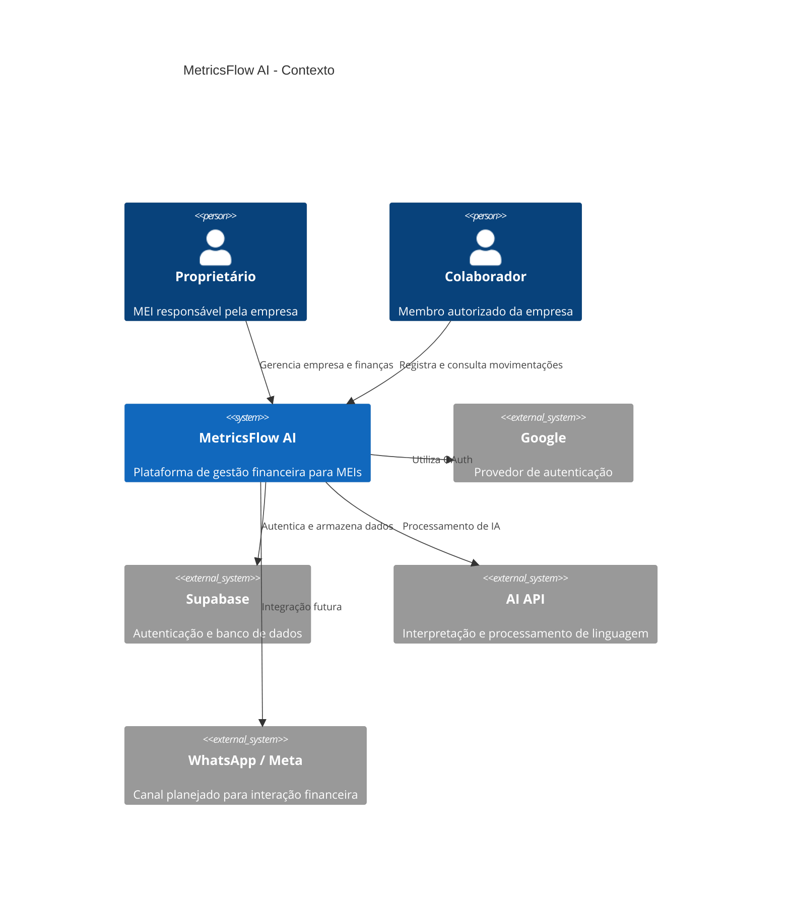
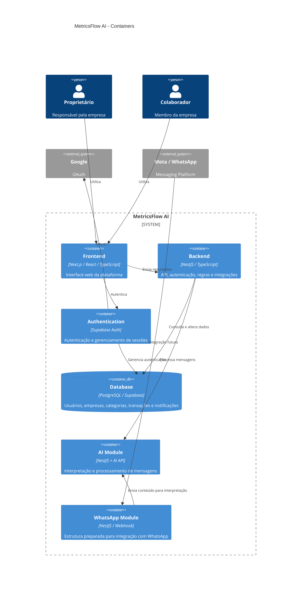
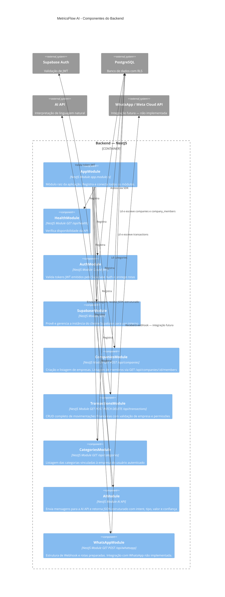

# 🏗️ C4 Model — MetricsFlow AI

# 🏗️ Diagramação C4 — MetricsFlow AI

> A integração com WhatsApp está estruturada no código, mas **não implementada em produção**.

## 🏛️ Diagrama de Contexto

---

## 📦 Diagrama de Containers 

---

---

## 🧩 Diagramas de Componentes

---

## Componentes — Frontend (Next.js)

```mermaid
C4Component

    title MetricsFlow AI - Componentes do Frontend

    Person(user, "Usuário", "Proprietário ou Colaborador")

    Container_Boundary(frontend, "Frontend — Next.js / App Router") {

        Component(landing, "Landing Page", "Next.js Page /", "Página pública de apresentação da plataforma")
        Component(auth_pages, "Auth Pages", "Next.js Pages /(auth)", "Login, Cadastro, Recuperar Senha e Redefinição de Senha")
        Component(callback, "Auth Callback", "Next.js Route Handler /auth/callback", "Processa retorno OAuth. Cria perfil e redireciona para onboarding ou dashboard.")
        Component(onboarding, "Onboarding", "Next.js Page /onboarding", "Fluxo de configuração inicial: criar ou ingressar em empresa via código de convite")
        Component(dashboard, "Dashboard", "Next.js Page /dashboard", "Visão financeira consolidada: faturamento, receitas, despesas, lucro, gráficos e transações recentes")
        Component(movimentacoes, "Movimentações", "Next.js Page /movimentacoes", "CRUD de receitas e despesas. Filtros, busca e exportação para CSV.")
        Component(dre, "DRE", "Next.js Page /dre", "Demonstração do Resultado do Exercício com gráficos e exportação CSV")
        Component(empresa, "Empresa", "Next.js Page /empresa", "Dados cadastrais, membros, papéis de acesso e código de convite")
        Component(perfil, "Perfil", "Next.js Page /perfil", "Informações pessoais e configurações de segurança")
        Component(preferencias, "Preferências", "Next.js Page /preferencias", "Aparência, notificações, moeda e configurações da conta")
        Component(demo, "Demo", "Next.js Page /demo", "Modo demonstração da plataforma sem autenticação real")

        Component(middleware, "Middleware", "Next.js Middleware", "Intercepta requisições e protege rotas autenticadas. Redireciona usuários não autenticados.")
        Component(hooks, "Custom Hooks", "React Hooks /hooks", "useEmpresa, useTransactions, useCompanyRole, useDRE, useNotifications, usePreferences...")
        Component(contexts, "Contexts", "React Context /contexts", "CompanyContext: distribui empresa ativa e estado global entre os componentes")
        Component(components_ui, "Componentes UI", "React Components /components", "Sidebar, Header, Cards, Charts, Modals, Forms e Tables reutilizáveis")
        Component(supa_client, "Supabase Client", "lib/supabase/client.ts · server.ts", "Instâncias do cliente Supabase para uso no browser e no servidor")
    }

    System_Ext(supa_auth, "Supabase Auth", "Autenticação e sessões JWT")
    System_Ext(postgres, "PostgreSQL", "Banco de dados com RLS")
    System_Ext(backend_api, "Backend API", "NestJS REST API")

    Rel(user, landing, "Acessa")
    Rel(user, auth_pages, "Faz login ou cadastro")
    Rel(auth_pages, supa_auth, "Autentica via email ou Google OAuth")
    Rel(callback, supa_auth, "Troca code por sessão")
    Rel(callback, postgres, "Cria perfil do usuário OAuth")
    Rel(middleware, supa_auth, "Valida sessão em cada requisição")
    Rel(dashboard, hooks, "Consulta dados financeiros")
    Rel(movimentacoes, hooks, "CRUD de transações")
    Rel(dre, hooks, "Consulta indicadores do período")
    Rel(empresa, hooks, "Gerencia membros e dados")
    Rel(hooks, supa_client, "Queries com RLS")
    Rel(hooks, backend_api, "Chama API REST")
    Rel(supa_client, supa_auth, "Obtém token de sessão")
    Rel(supa_client, postgres, "Lê e escreve dados")
    Rel(contexts, hooks, "Distribui estado da empresa")
    Rel(components_ui, contexts, "Consome estado global")
```

---

## Componentes — Backend (NestJS)

---
