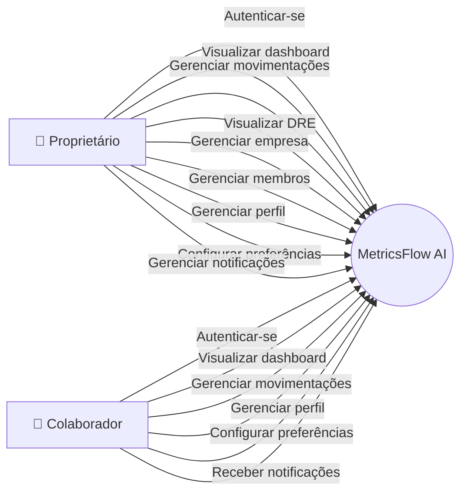
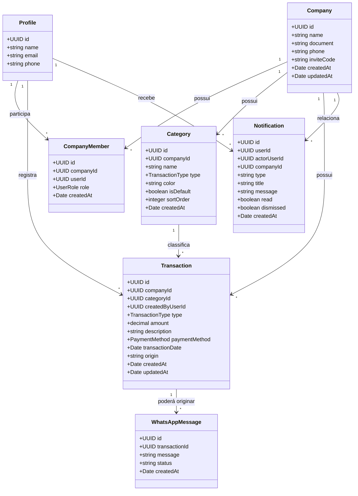
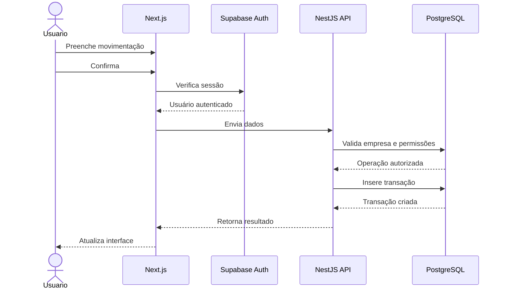
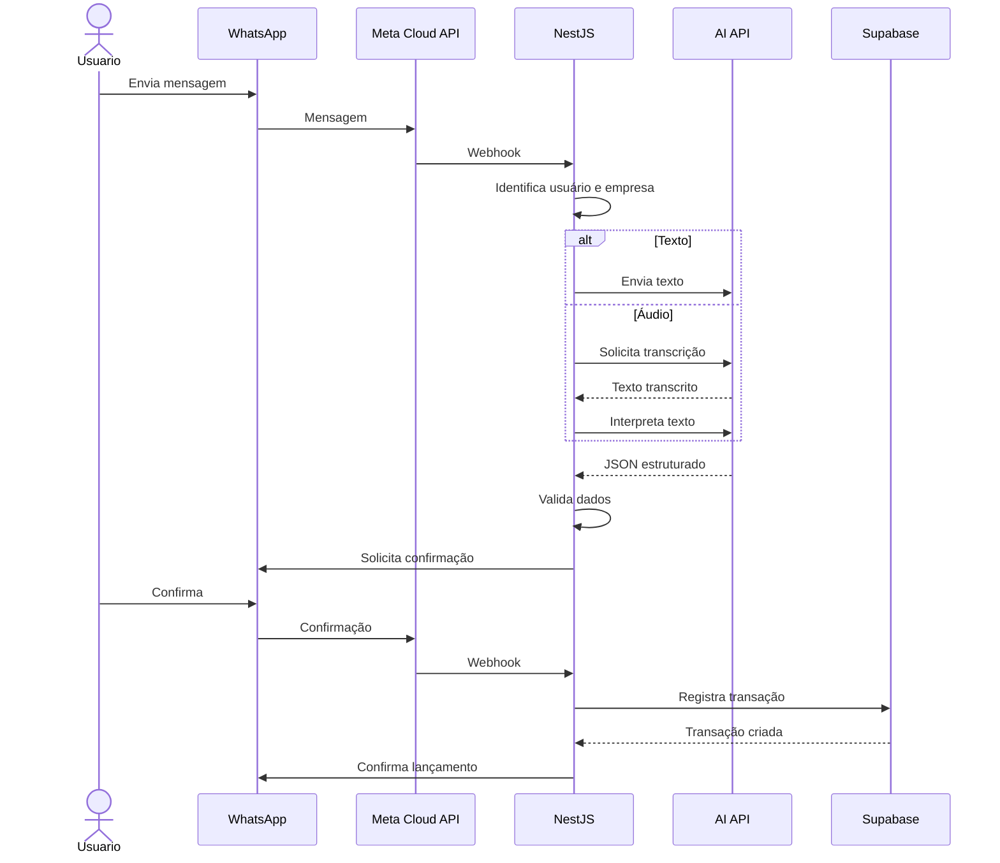
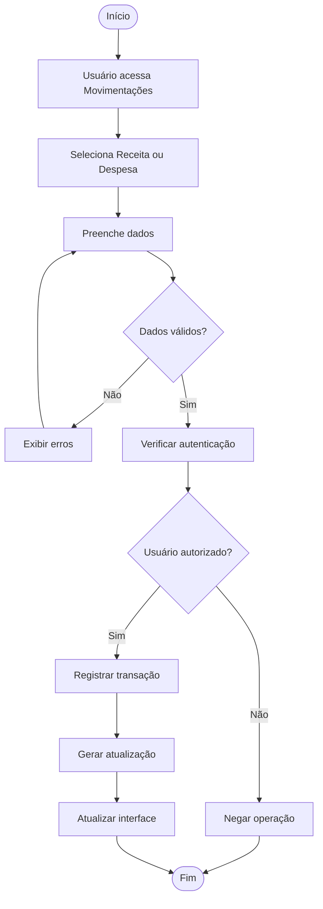

# 📐 Diagramas UML — MetricsFlow AI

# 👥 Diagrama de Caso de Uso

---

# 📦 Diagrama de Classes

---

# 🔄 Diagrama de Sequência — Movimentação Web

---

# 🤖 Diagrama de Sequência — Fluxo futuro do WhatsApp

> Este fluxo representa a arquitetura planejada. A integração efetiva com o WhatsApp ainda não está concluída.

---

# ⚙️ Diagrama de Atividade

## Registro de movimentação pela plataforma

---
